<div align="center">

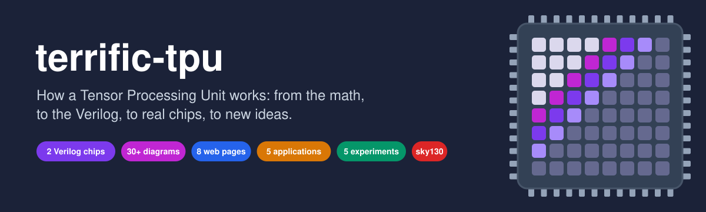


</div>

**terrific-tpu** teaches how a **Tensor Processing Unit (TPU)** works by building one you can read in an afternoon, then pushing it into places a TPU was never meant to go.

**TinyTPU** has the same blocks as Google's first TPU, shrunk from a 256 × 256 grid of multipliers to 4 × 4. It comes in two versions: a simple one, and a pipelined one with TPU v1's double-buffered weights. Both are tested against a shared answer key, synthesized onto real 130 nm cells, and mirrored in a cycle-exact browser simulator. On top of that: **five applications** (a neural network, a Fourier transform, image filtering, Grover's quantum search, and graph triangle counting) and **six experiments** you can rerun and extend, and a **research library** mapping 28 papers to the code.

The goal: **understand a TPU first, then find new things to use it for.**

<div align="center">

### [▶ Open the live site](https://normansrule.github.io/terrific-tpu/web/) · [Take the 3-D tour](https://normansrule.github.io/terrific-tpu/web/tour.html) · [Zoom into the silicon](https://normansrule.github.io/terrific-tpu/web/xray.html) · [Run the race](https://normansrule.github.io/terrific-tpu/web/race.html) · [Try the challenges](https://normansrule.github.io/terrific-tpu/web/challenges.html)

<a href="https://normansrule.github.io/terrific-tpu/web/tour.html">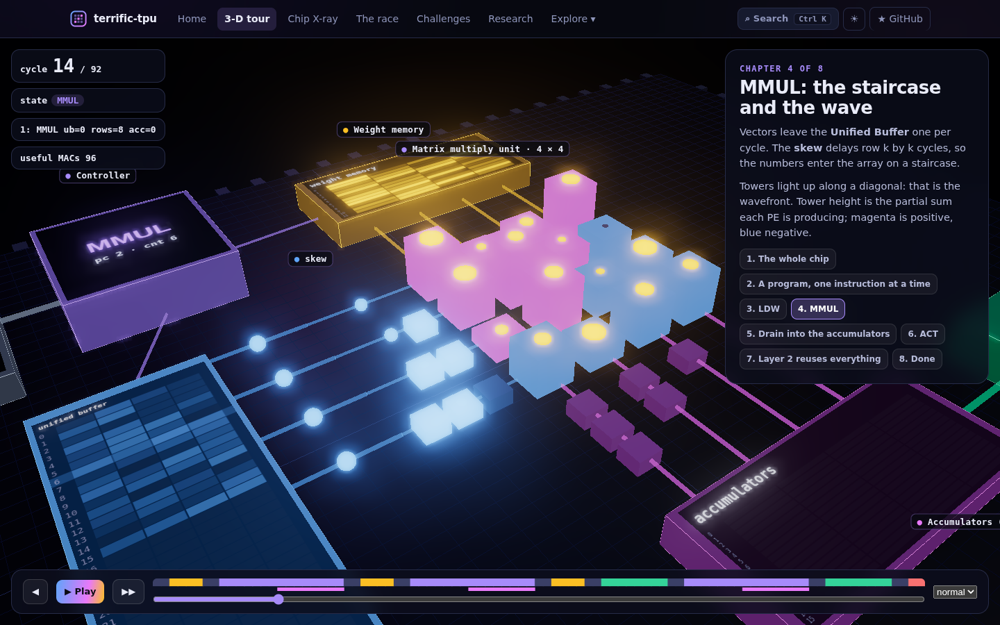</a>


</div>

<div align="center">
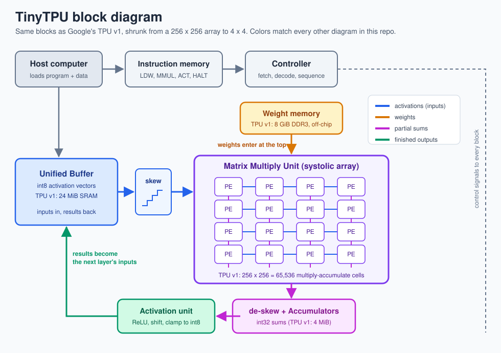
</div>

---

## The color code

Every diagram, every web page, and every lesson uses the same colors.

| Color | Means | Moves |
|---|---|---|
| 🟦 **Blue** | activations (input data) | left → right through the array |
| 🟧 **Amber** | weights (what the network learned) | loaded once, then **stays put** |
| 🟪 **Magenta** | partial sums (running totals) | top → bottom |
| 🟩 **Green** | finished outputs | out of the bottom, back to memory |
| 🟣 **Violet** | the compute array itself | |

---

## Start here: the web pages

Everything runs in the browser, on GitHub Pages or locally with `make serve`. Press **Ctrl K** (or **/**) on any page to jump anywhere. The simulators use a JavaScript model that is checked cycle-for-cycle against the Verilog on every commit.

| | Page | What you do |
|---|---|---|
| 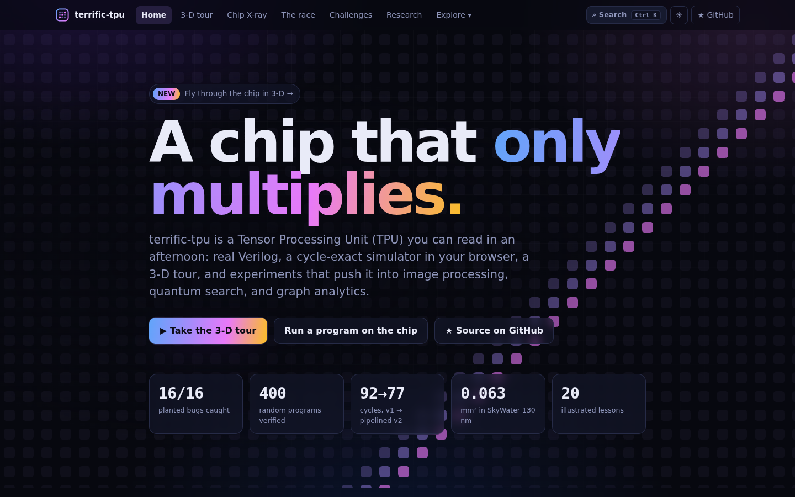 | [**Home**](web/index.html) | an interactive systolic field, a scroll-driven story of the four beats of a matrix multiply, and every command you need |
|  | [**3-D chip tour**](web/tour.html) | fly through the whole chip in 3-D while it runs a real neural network; 8 guided chapters, a 92-cycle scrubber, hover any PE to read its registers |
| 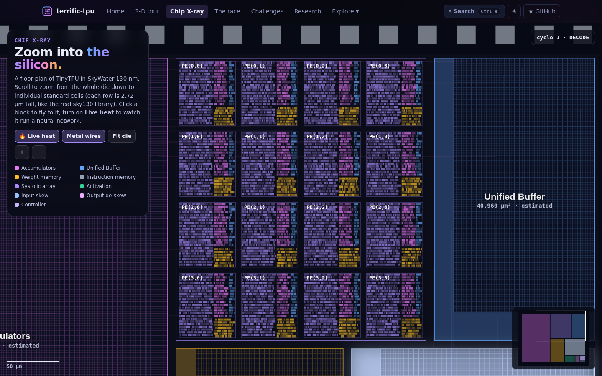 | [**Chip X-ray**](web/xray.html) | a zoomable floor plan of the die in SkyWater 130 nm: scroll from the whole chip down to individual standard cells in 2.72 µm rows, and watch blocks glow as the chip runs a neural network |
| 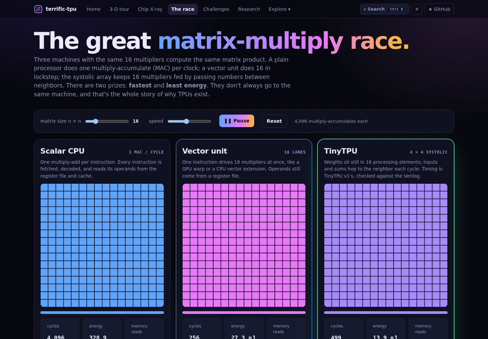 | [**The race**](web/race.html) | a scalar CPU, a vector unit, and the systolic array compute the same matrix product; one prize for fastest, one for least energy |
| 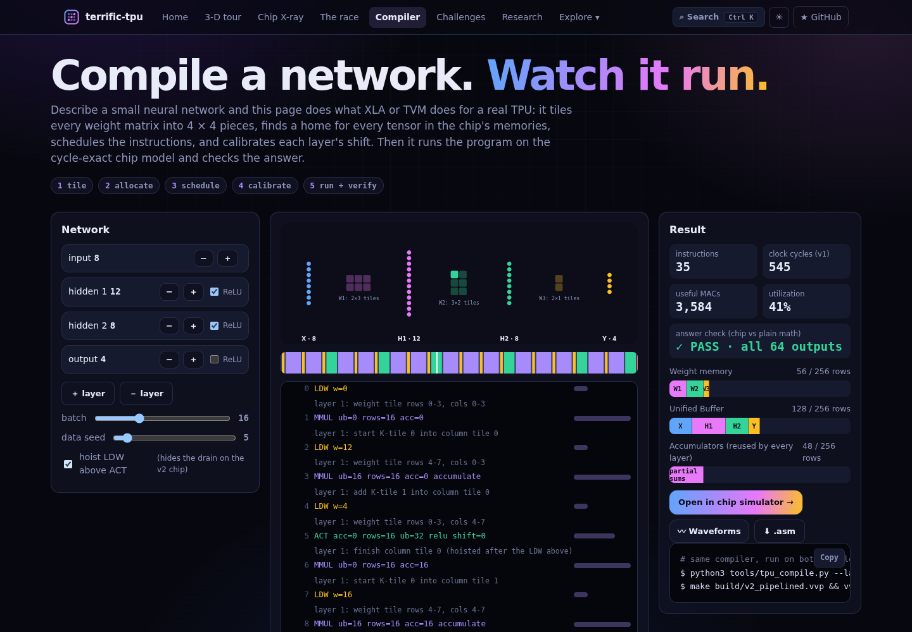 | [**Compiler**](web/compile.html) | design a neural network with buttons; the page tiles it, allocates memory, schedules instructions, calibrates shifts, runs it on the chip model, and checks every output; one click opens it in the simulator or the waveform viewer |
| 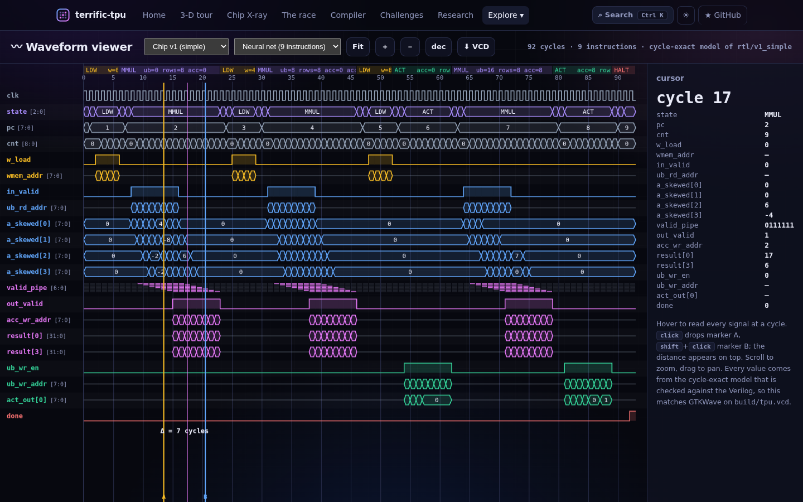 | [**Waveform viewer**](web/wave.html) | GTKWave in the browser: every signal on every cycle, zoom, markers with cycle distances, and a VCD download |
| 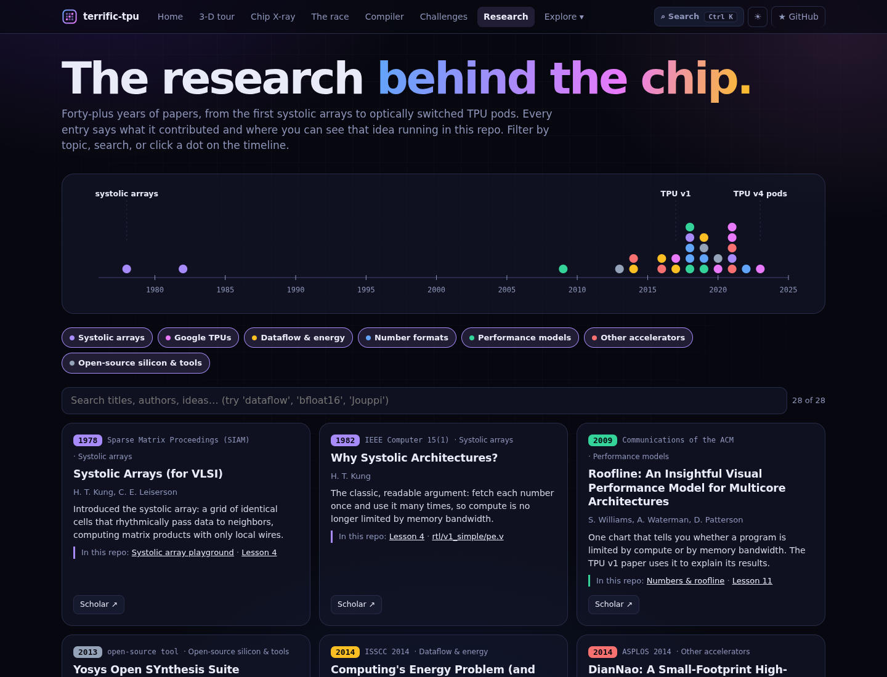 | [**Research library**](web/research.html) | 28 papers from Kung's 1978 systolic arrays to TPU v4's optical pods, on a clickable timeline, each mapped to the lesson or file where the idea lives |
| 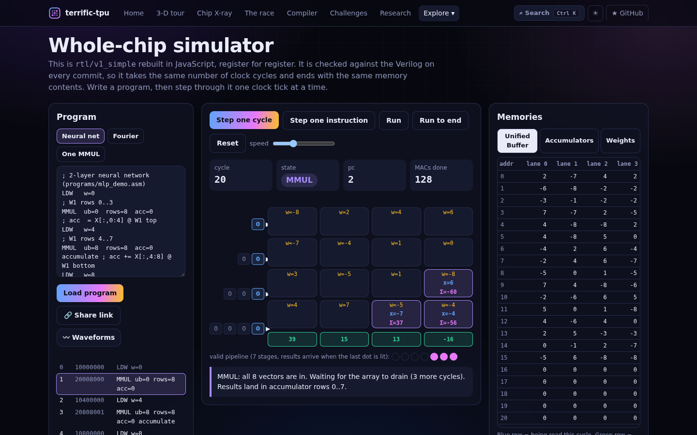 | [**Chip simulator**](web/chip.html) | write assembly and step it clock by clock: controller, skew, array, every memory |
| 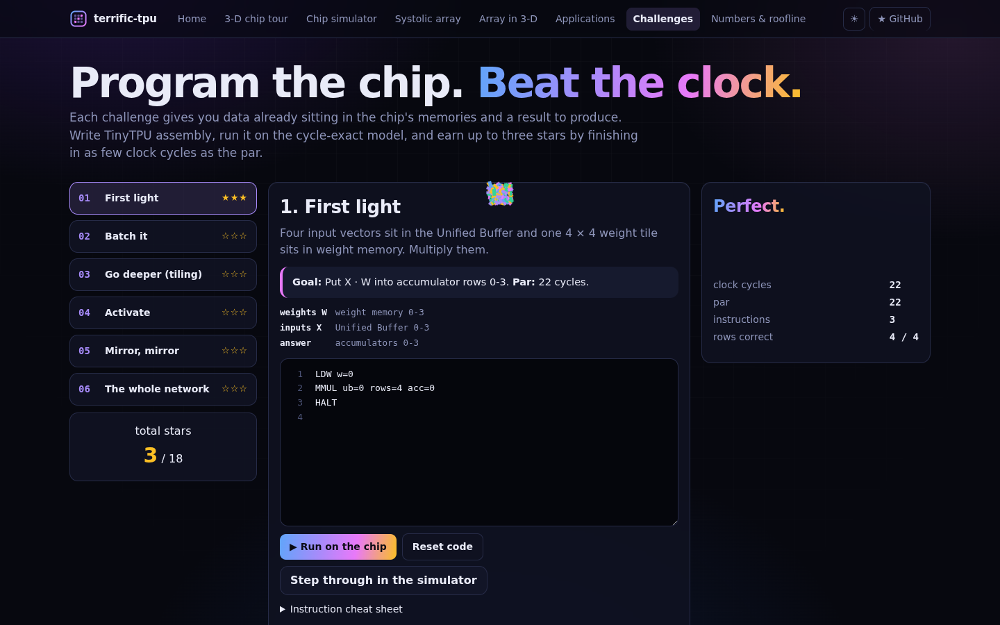 | [**Challenges**](web/challenges.html) | six programming puzzles, from "first light" to "the whole network"; beat the par for three stars |
| 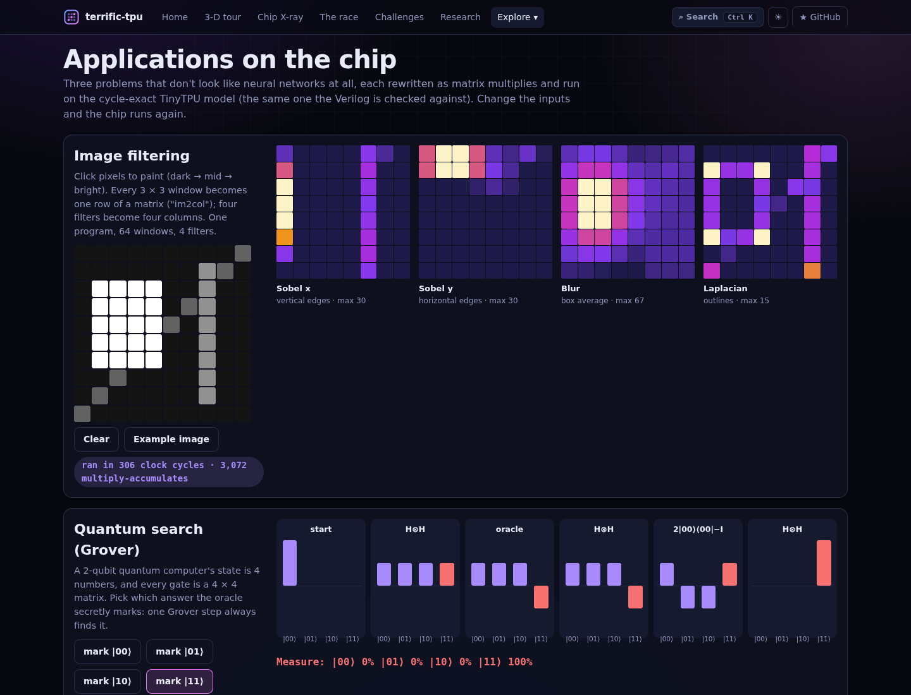 | [**Applications**](web/apps.html) | paint an image for 4 filters, pick the answer for Grover's search, draw a graph and count triangles |
| 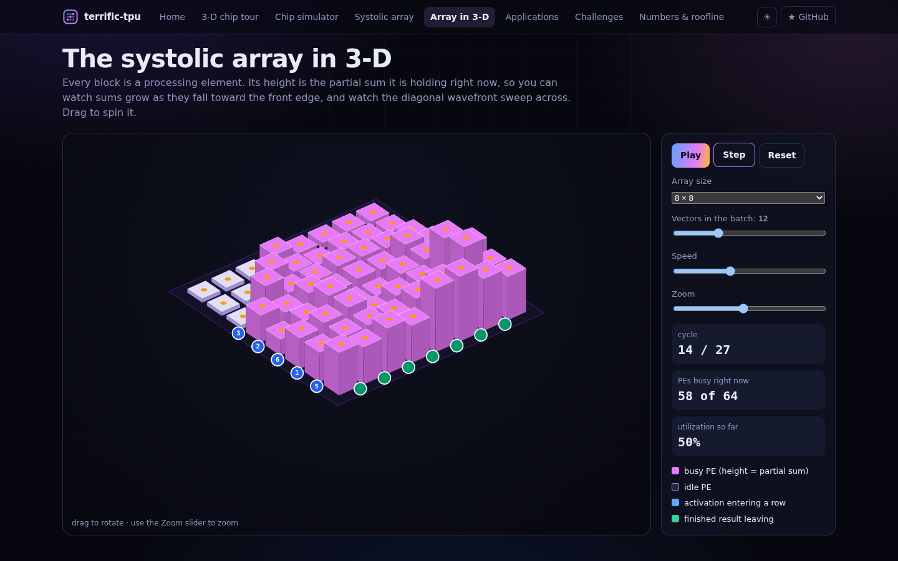 | [**Array in 3-D**](web/array3d.html) | spin an array of up to 24 × 24 PEs; tower heights are live partial sums |
| 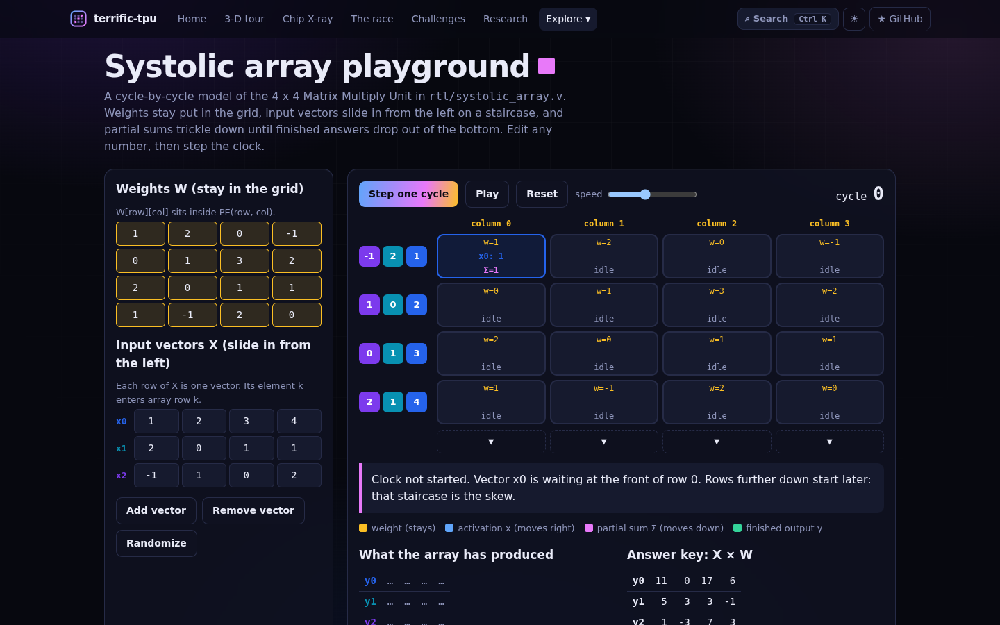 | [**Systolic array**](web/playground.html) | edit weights and inputs, step the clock, see every multiply-accumulate |
| 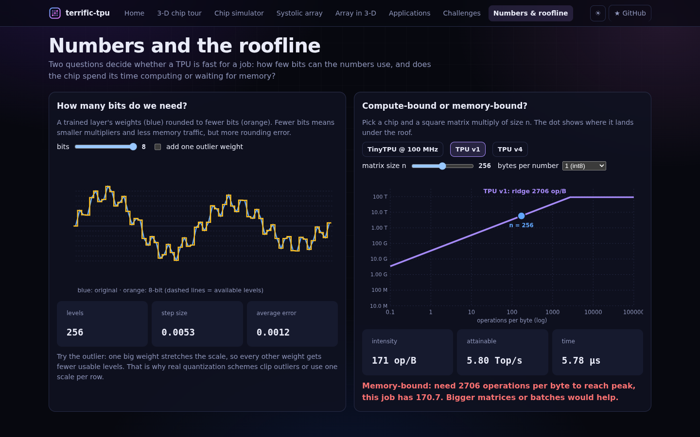 | [**Numbers & roofline**](web/explorers.html) | round weights to fewer bits; see whether a job is compute- or memory-bound |

---|---|
| [**Start**](web/index.html) | a live wavefront and a map of the lessons |
| [**Systolic array**](web/playground.html) | edit weights and inputs, step the clock, watch sums flow down the grid |
| [**Whole chip**](web/chip.html) | write TinyTPU assembly and run it on a register-exact model of the Verilog; see the controller, skew, array, and every memory |
| [**Numbers & roofline**](web/explorers.html) | round weights to fewer bits; see whether a job is compute- or memory-bound |
| [**Applications**](web/apps.html) | paint an image and watch 4 filters run; pick the answer a quantum search should find; draw a graph and count its triangles |
| [**3-D array**](web/array3d.html) | spin an array of up to 24 × 24 PEs in 3-D; tower heights are live partial sums |

---

## The lessons

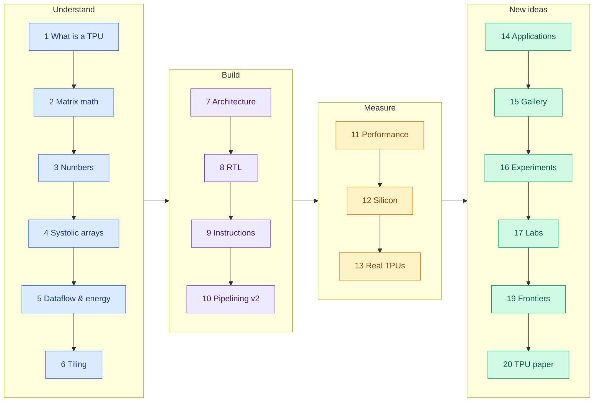
```mermaid
flowchart LR
    subgraph U["Understand"]
      A1["1 What is a TPU"] --> A2["2 Matrix math"] --> A3["3 Numbers"] --> A4["4 Systolic arrays"] --> A5["5 Dataflow & energy"] --> A6["6 Tiling"]
    end
    subgraph B["Build"]
      B7["7 Architecture"] --> B8["8 RTL"] --> B9["9 Instructions"] --> B10["10 Pipelining v2"]
    end
    subgraph M["Measure"]
      M11["11 Performance"] --> M12["12 Silicon"] --> M13["13 Real TPUs"]
    end
    subgraph N["New ideas"]
      N14["14 Applications"] --> N15["15 Gallery"] --> N16["16 Experiments"] --> N17["17 Labs"] --> N19["19 Frontiers"] --> N20["20 TPU paper"]
    end
    U --> B --> M --> N
    classDef u fill:#DBEAFE,stroke:#2563EB,color:#1E3A8A
    classDef b fill:#EDE9FE,stroke:#7C3AED,color:#4C1D95
    classDef m fill:#FEF3C7,stroke:#D97706,color:#92400E
    classDef n fill:#D1FAE5,stroke:#059669,color:#065F46
    class A1,A2,A3,A4,A5,A6 u
    class B7,B8,B9,B10 b
    class M11,M12,M13 m
    class N14,N15,N16,N17,N19,N20 n
```

| # | Lesson | You'll see |
|---|---|---|
| 1 | [What is a TPU?](docs/01-what-is-a-tpu.md) | CPU vs GPU vs TPU, a decade of generations |
| 2 | [Why matrix math?](docs/02-why-matrix-math.md) | every layer is multiply, add, squash; arithmetic intensity |
| 3 | [Numbers and quantization](docs/03-numbers-and-quantization.md) | int8, bfloat16, 32-bit accumulators, saturation |
| 4 | [Systolic arrays](docs/04-systolic-arrays.md) | the processing element, the skew, the diagonal wavefront |
| 5 | [Dataflow and energy](docs/05-dataflow-and-energy.md) | why DRAM costs 3,000 multiplies; three dataflows; the memory pyramid |
| 6 | [Tiling big matrices](docs/06-tiling.md) | how a 4 × 4 grid multiplies anything |
| 7 | [TinyTPU architecture](docs/07-architecture.md) | block diagram, memory map, state machine, a **real waveform** |
| 8 | [RTL walkthrough](docs/08-rtl-walkthrough.md) | every Verilog file, and how it is verified |
| 9 | [Instructions and programming](docs/09-instruction-set.md) | the five instructions, the assembler, TPU v1's instructions, JAX and XLA |
| 10 | [Pipelining: TinyTPU v2](docs/10-pipelining-v2.md) | shadow weights, the swap wavefront, hazards, **92 → 77 cycles** |
| 11 | [Performance](docs/11-performance.md) | utilization **measured on the RTL**, the roofline for TPU v1 and v4 |
| 12 | [From RTL to silicon](docs/12-rtl-to-silicon.md) | **real sky130 area**: one PE ≈ 6,867 µm² |
| 13 | [Real TPUs](docs/13-real-tpus.md) | TPU v1 to TPU 8t/8i, pods, die area, a photo tour |
| 14 | [New applications](docs/14-new-applications.md) | a fit checklist, published science uses, an idea bank |
| 15 | [Application gallery](docs/15-application-gallery.md) | **image filtering, Grover's quantum search, graph triangles**, drawn from the chip's own memory |
| 16 | [Experiments](docs/16-experiments.md) | **six experiments**: speedup, bits, energy, space-time, scaling, sparsity |
| 17 | [Hands-on labs](docs/17-labs.md) | eight labs, from "grow the array" to "your own application" |
| 18 | [References](docs/18-references.md) | papers, books, English-language videos, tools |
| 19 | [Research frontiers](docs/19-research-frontiers.md) | sparsity, fewer bits, dataflow search, memory, compilers, open silicon; a project for each |
| 20 | [Reading the TPU v1 paper](docs/20-reading-the-tpu-paper.md) | the original paper, section by section, mapped to this repo |
| 📖 | [Glossary](docs/glossary.md) | every acronym spelled out |

---

## A taste of the pictures

| | |
|---|---|
| 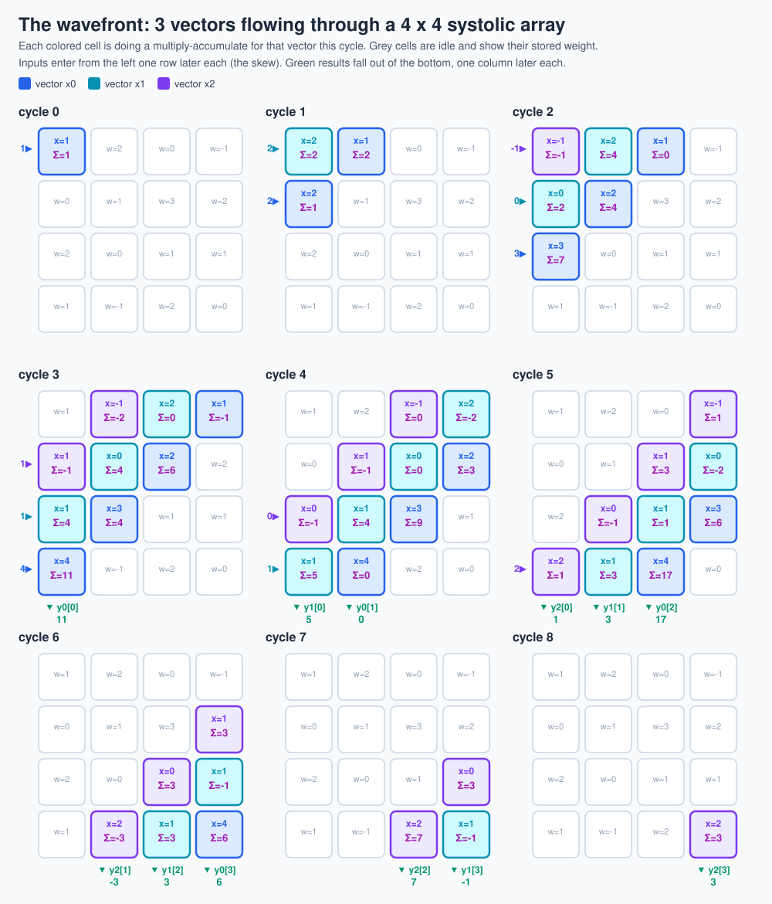 | 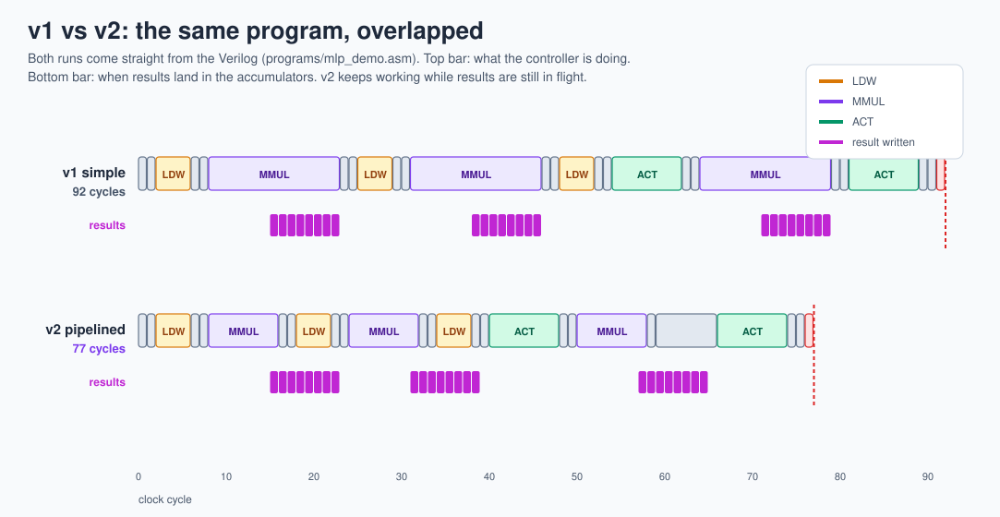 |
| **The wavefront**: three vectors crossing the array, one panel per clock cycle | **v1 vs v2**, drawn from the Verilog simulation |
| 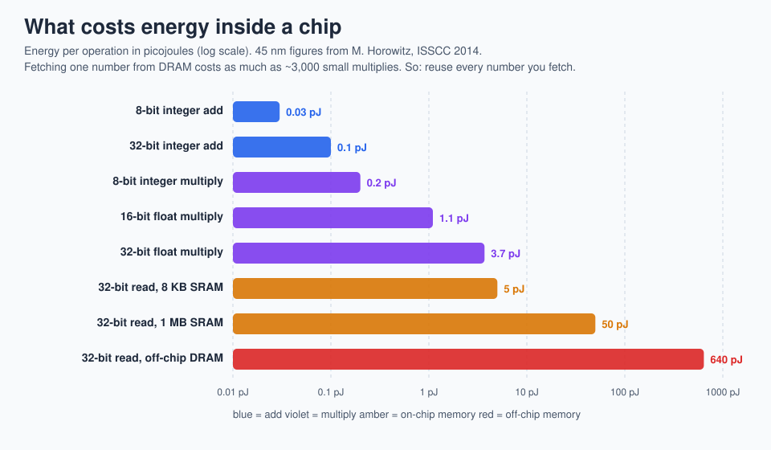 |  |
| **Why data movement dominates** (Horowitz, 45 nm) | **The roofline** for TPU v1 and TPU v4 |
| 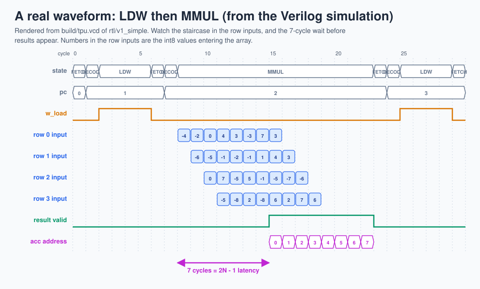 | 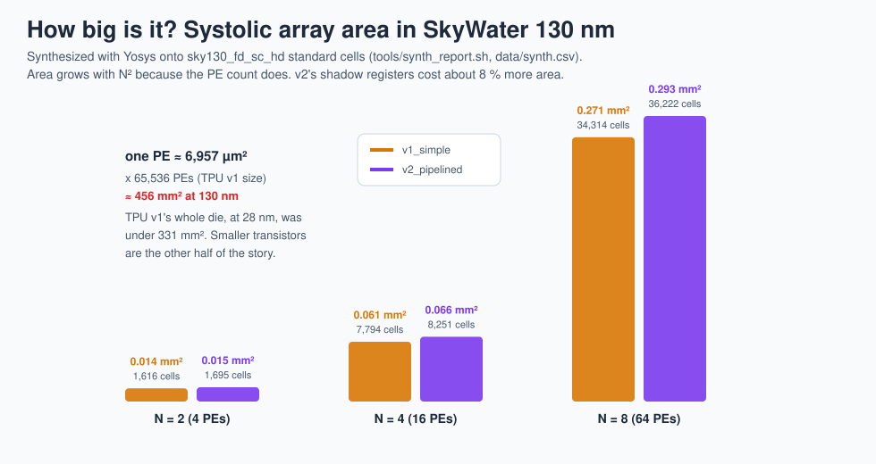 |
| **A real waveform** of `LDW` + `MMUL` | **Real area** in SkyWater 130 nm |
| 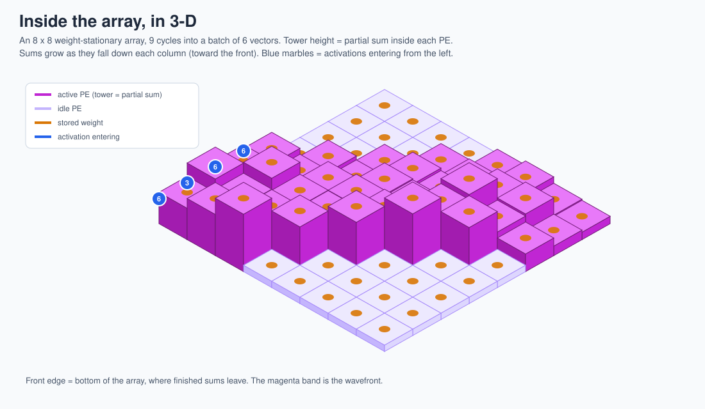 | 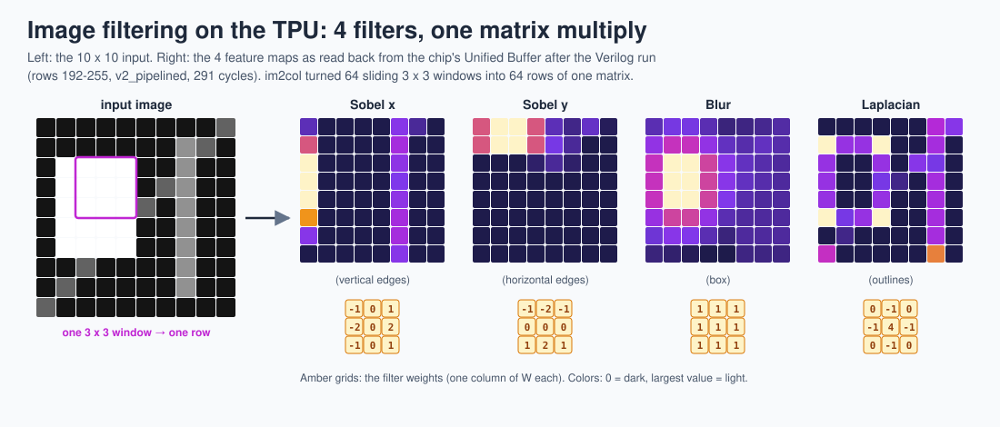 |
| **The array in 3-D**, towers = partial sums | **Image filtering**, read back from the chip's memory |
| 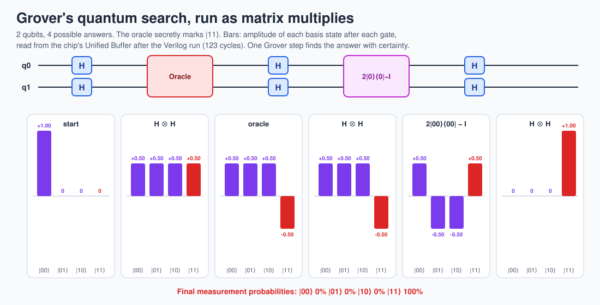 | 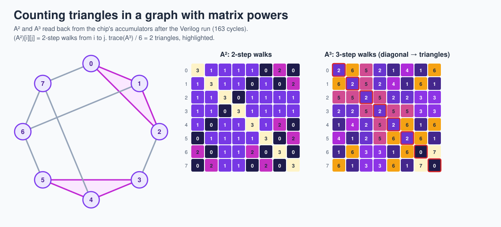 |
| **Grover's quantum search** as matrix multiplies | **Triangles in a graph** from A² and A³ |
| 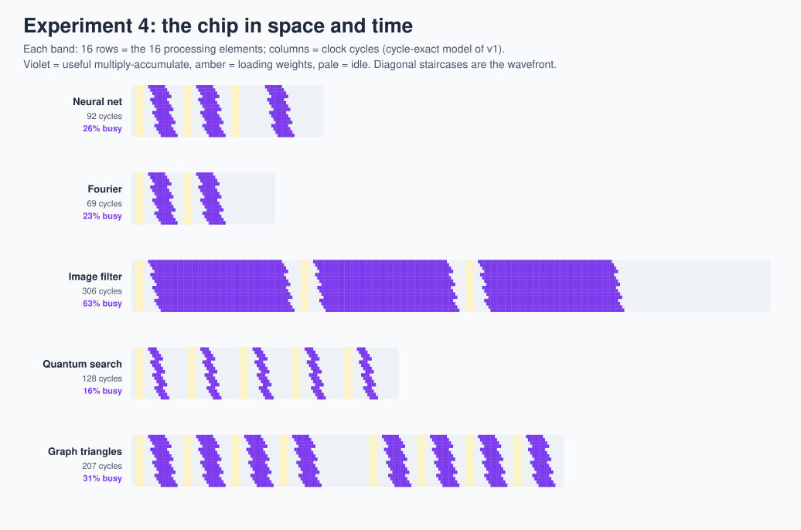 | 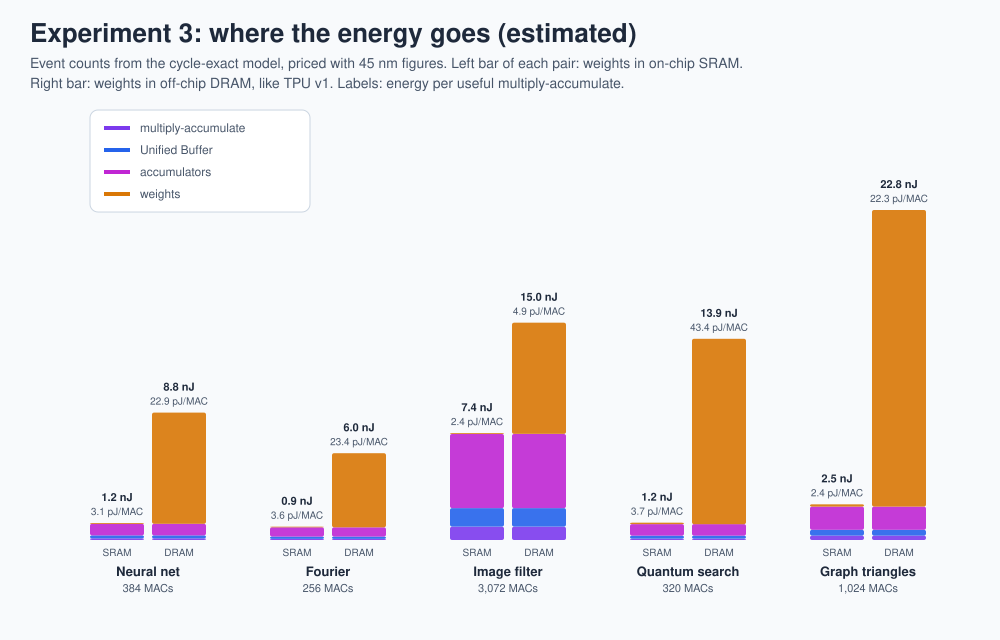 |
| **Experiment 4**: every PE, every cycle | **Experiment 3**: where the energy goes |

Every chart marked "measured" is regenerated from the hardware by `make diagrams`.

---

## Run it (Ubuntu or Windows Subsystem for Linux)

```bash
# tools
sudo apt update
sudo apt install -y iverilog gtkwave yosys python3 nodejs make git

# get the repo
git clone https://github.com/Normansrule/terrific-tpu.git
cd terrific-tpu

make                 # neural network demo on both chips
make dft             # a Fourier transform on the same hardware
make apps            # image filter, quantum search, graph triangles
make compile-test    # compile 4 neural networks and run them on both Verilog chips
python3 tools/tpu_compile.py --layers 8,12,8,4 --batch 16 --hoist -v   # the compiler by itself
make experiments     # 6 experiments -> experiments/results/*.csv + charts
make fuzz            # 200 random programs per chip vs the instruction-level model
make scale           # array sizes 2, 4, 8, 16
make jscheck         # the browser simulator must match the Verilog cycle for cycle
make mutants         # plant 16 bugs; every one must be caught
make test            # all of the above (includes the applications and compiled networks)

make diagrams        # redraw every generated SVG (runs the Verilog)
make synth           # sky130 area (set SKY130_LIB to your liberty file)
make wave            # open the waveform in GTKWave
make serve           # the website at http://localhost:8000/web/  (make serve PORT=8080 if 8000 is busy)
make screenshots     # re-capture docs/img/*.png (pip install playwright && playwright install chromium)
```

Expected from `make`:

```
v1_simple      mlp   TinyTPU finished in 92 clock cycles  PASS - all 512 memory words match the answer key
v2_pipelined   mlp   TinyTPU finished in 77 clock cycles  PASS - all 512 memory words match the answer key
```

### How it is tested

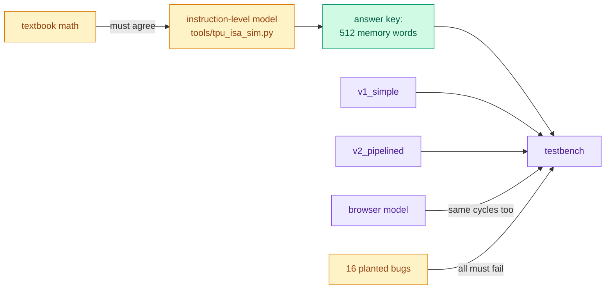
```mermaid
flowchart LR
    ISA["instruction-level model<br/>tools/tpu_isa_sim.py"] --> KEY["answer key:<br/>512 memory words"]
    MATH["textbook math"] -->|must agree| ISA
    KEY --> TB["testbench"]
    V1["v1_simple"] --> TB
    V2["v2_pipelined"] --> TB
    JS["browser model"] -->|same cycles too| TB
    MUT["16 planted bugs"] -->|all must fail| TB
    classDef m fill:#FEF3C7,stroke:#D97706,color:#92400E
    classDef h fill:#EDE9FE,stroke:#7C3AED,color:#4C1D95
    classDef k fill:#D1FAE5,stroke:#059669,color:#065F46
    class ISA,MATH,MUT m
    class V1,V2,JS,TB h
    class KEY k
```

---

## Put the web pages online (GitHub Pages)

1. Push the repo to GitHub.
2. **Settings → Pages → Deploy from a branch**, branch `main`, folder `/ (root)`.
3. Open `https://normansrule.github.io/terrific-tpu/` (it forwards to `web/`).

The 3-D pages load a vendored copy of three.js from `web/vendor/` (MIT license), so nothing depends on an outside CDN. Open them through a web server (`make serve` or GitHub Pages), not by double-clicking the file: browsers refuse to load JavaScript modules from `file://`.

The workflow in [`.github/workflows/sim.yml`](.github/workflows/sim.yml) runs `make test` on every push.

---

## Repo map

```
terrific-tpu/
├── rtl/
│   ├── common/           skew.v · accumulators.v · activation.v
│   ├── v1_simple/        pe.v · systolic_array.v · controller.v · tpu_top.v
│   └── v2_pipelined/     pe_db.v · systolic_array_db.v · controller_pipe.v · tpu_top.v
├── tb/                   tb_tpu_top.v (any program, any version) · tb_scale.v (N = 2..16)
├── programs/             mlp_demo · dft4 · conv2d · grover2 · graph_paths (.asm)
├── tools/
│   ├── tpu_asm.py           assembler + disassembler
│   ├── tpu_isa_sim.py       instruction-level model (the meaning of every program)
│   ├── golden_model.py      demos + dependency-biased random-program generator
│   ├── apps.py              application data + independent reference math
│   ├── tpu_compile.py       neural-network compiler: tiling, allocation, scheduling, calibration
│   ├── trace_js.js          per-cycle trace of the browser model
│   ├── mutation_test.sh     16 planted bugs
│   ├── check_js_sim.js      browser model vs Verilog
│   ├── synth_report.sh      Yosys + sky130 area report
│   └── diagrams/            every generated SVG (concept + measured)
├── experiments/          e1..e5 scripts, common.py, results/*.csv
├── web/                  index · tour · xray · race · compile · challenges · research · chip · wave · apps · array3d · playground · explorers
│   ├── tinytpu-core.js      cycle-exact JavaScript model of the chip + assembler
│   ├── assets/              theme.css (design system) · ui.js (navigation, animations)
│   └── vendor/three/        three.js r160 (MIT), for the 3-D pages
├── diagrams/             32 SVGs (hand-drawn, concept, measured, application, experiment)
├── data/synth.csv        synthesis results
├── docs/                 20 lessons + glossary
└── sim/tpu.gtkw          GTKWave layout
```

<div align="center">

**Start here → [Lesson 1: What is a TPU?](docs/01-what-is-a-tpu.md)**

</div>

<sub>Design credits: the web pages' visual effects (spotlight cards, border beams, shimmer buttons, marquees, number tickers, scroll-driven storytelling, a 3-D guided walkthrough) are hand-written re-creations of ideas popularized by open-source projects including Magic UI, React Bits, Motion Primitives, GSAP demos, Bruno Simon's folio, bbycroft/llm-viz and Polo Club's Transformer Explainer. No code from them is included.</sub>
