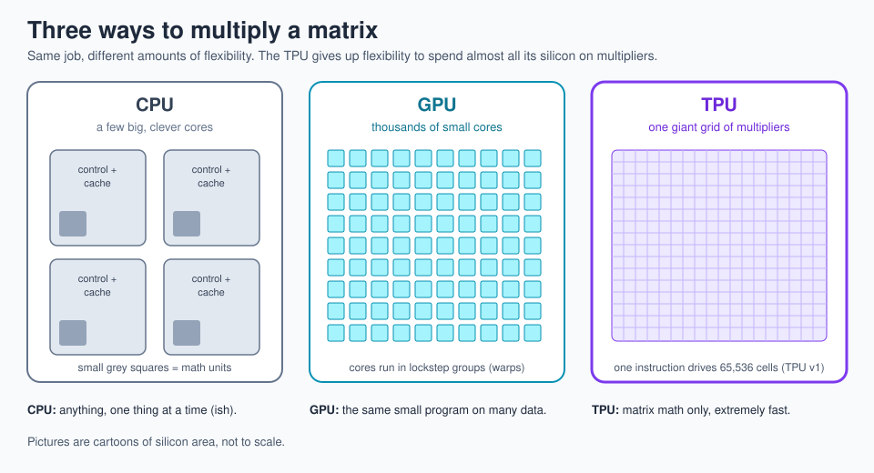
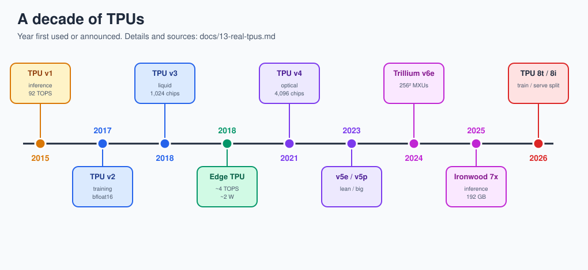
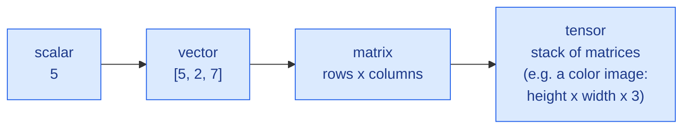

# 1 · What is a Tensor Processing Unit (TPU)?

> **In one sentence:** a TPU is a chip that gives up almost everything a normal processor can do, so it can multiply big grids of numbers extremely fast and with very little energy.

## The problem Google hit

Around 2013, Google estimated that if people used voice search for just a few minutes a day, running the speech-recognition neural networks on normal servers would have meant roughly **doubling** its datacenters. Buying that many computers was not an option, so a small team designed a custom chip in about 15 months. That chip, TPU v1, went into Google datacenters in 2015 and was described publicly in 2016–2017.

## Three kinds of chips

| | Central Processing Unit (CPU) | Graphics Processing Unit (GPU) | Tensor Processing Unit (TPU) |
|---|---|---|---|
| Good at | anything | the same small program on lots of data | matrix multiply, and not much else |
| Silicon spent on | control logic, branch prediction, big caches | thousands of simple cores | one giant grid of multipliers |
| How many multiplies per clock | tens to hundreds | thousands to tens of thousands | **65,536** in TPU v1 |
| Analogy | a master chef | a school cafeteria line | a car factory assembly line |

## Why "tensor"?

A **tensor** is just a grid of numbers with any number of directions:

Neural networks store what they have learned as tensors of **weights**, and they turn inputs into outputs mostly by **multiplying tensors**. A chip built for that is a Tensor Processing Unit.

## The three big ideas (the rest of the repo explains each)

1. **Do one thing.** A TPU's main instruction is effectively "multiply this matrix". One instruction keeps tens of thousands of multipliers busy for many cycles, so almost no energy goes into fetching and decoding instructions.
2. **Move data as little as possible.** Moving a number across a chip costs far more energy than multiplying it. A **systolic array** passes each number directly to its neighbor, so a value read from memory once is used many times.
3. **Use small numbers.** Neural networks still work well with 8-bit integers or 16-bit "brain floating point" (bfloat16) numbers. Smaller numbers mean smaller, cooler, cheaper multipliers.

## What TinyTPU keeps and drops

TinyTPU (this repo) keeps ideas 1–3 and the same block layout as TPU v1, in two versions: **v1_simple** does one instruction at a time, and **v2_pipelined** adds TPU v1's double-buffered weights and overlaps instructions ([lesson 10](10-pipelining-v2.md)). It drops what isn't needed to understand the idea: the host PCIe interface, off-chip memory, pooling hardware, and the 256 × 256 size.

| | Google TPU v1 | TinyTPU |
|---|---|---|
| Systolic array | 256 × 256 | 4 × 4 (change `N` to grow it) |
| Data type | 8-bit integer | 8-bit integer |
| Accumulators | 32-bit, 4 MiB | 32-bit, 256 entries |
| Unified Buffer | 24 MiB | 256 vectors |
| Clock | 700 MHz | whatever your simulator likes |

**Next → [2 · Why matrix math?](02-why-matrix-math.md)**
