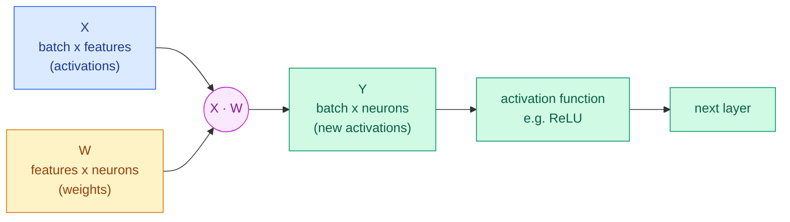

# 2 · Why matrix math?

> **In one sentence:** one layer of a neural network is "multiply by a matrix, add, squash", so a chip that multiplies matrices fast runs neural networks fast.

## One neuron is a dot product

A neuron takes some inputs, multiplies each by a weight, and adds them up:

```
inputs    x = [ 1,  2,  3,  4 ]
weights   w = [ 2,  0, -1,  1 ]
                ─────────────────
products        2 + 0 + -3 + 4   =  3      ← one "dot product"
```

Each `multiply, then add to the running total` is one **Multiply-Accumulate (MAC)**. It is the single operation a TPU is built around.

## A layer is a matrix multiply

A layer has many neurons, and we usually push many inputs through at once (a **batch**). Stack the inputs as rows of **X** and the neurons' weights as columns of **W**:



Every entry of Y is one dot product: `Y[i][j] = sum over k of X[i][k] · W[k][j]`.

For an **M × K** input and a **K × N** weight matrix that is **M · K · N** MACs. A single layer of a language model can easily need billions.

## The same trick hides everywhere

| Neural network part | Secretly a matrix multiply? |
|---|---|
| Fully connected (dense) layer | Yes, directly |
| Convolution (images) | Yes, after rearranging image patches into rows ("im2col") |
| Attention in a Transformer | Yes: query × key, then × value |
| Embedding lookup | A matrix multiply with a one-hot vector (TPUs often use special hardware instead) |
| ReLU, softmax, layer norm | No, these are element-wise; a TPU has a separate, smaller unit for them |

## Why this is friendly to hardware

**1. Lots of reuse.** In `X · W`, every weight is used once per row of X, and every input is used once per column of W. Load a number once, use it many times.

**Arithmetic intensity** = MACs ÷ numbers moved from memory. For square `n × n` matrices it grows like `n`:

| Matrix size n | MACs (n³) | Numbers moved (≈3n²) | MACs per number moved |
|---|---|---|---|
| 4 | 64 | 48 | 1.3 |
| 256 | 16.8 million | 197 thousand | 85 |
| 4096 | 68.7 billion | 50 million | 1,365 |

Big matrices mean the chip spends its time computing, not waiting on memory. That is why TPUs like **big batches**.

**2. Predictable.** There are no "if" statements in a matrix multiply. The hardware knows every step in advance, so it needs no caches, no branch predictors, and no out-of-order logic.

**3. Low precision is fine.** Trained networks tolerate rounding. TPU v1 used 8-bit integers for inference (**quantization**): an 8-bit multiplier needs roughly one-sixth the energy and area of a 16-bit floating-point one, according to the TPU v1 paper's numbers.

Lesson 3 goes deeper into number formats and how TinyTPU rounds its results.

**Next → [3 · Numbers and quantization](03-numbers-and-quantization.md)**
