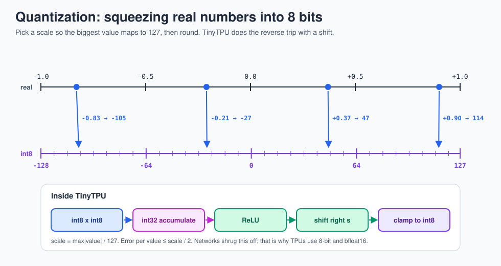

# 3 · Numbers and quantization

> **In one sentence:** neural networks still work when their numbers are rounded to 8 bits, and 8-bit multipliers are so much smaller and cheaper that a TPU can pack in tens of thousands of them.



## Why fewer bits is a big deal

The area and energy of a multiplier grow roughly with the **square** of its width, because an n-bit multiplier adds up n rows of n bits. So:

| Format | Bits | Relative multiplier size (≈ bits²) | Used by |
|---|---|---|---|
| 32-bit float (FP32) | 32 (24-bit mantissa) | ≈ 9x an 8-bit integer multiplier, plus exponent logic | CPUs, GPU training (historically) |
| bfloat16 (brain floating point) | 16 (8-bit mantissa) | ≈ 1x plus a small exponent adder | TPU v2 onward, for training |
| 8-bit integer (int8) | 8 | 1x | TPU v1, Edge TPU, TinyTPU |

The [energy chart in lesson 5](05-dataflow-and-energy.md) shows the same story with measured numbers: an 8-bit integer multiply costs about 0.2 pJ, a 32-bit float multiply about 3.7 pJ.

### bfloat16: the float Google invented for TPUs

```
FP32      sign | exponent (8 bits) | mantissa (23 bits)
bfloat16  sign | exponent (8 bits) | mantissa (7 bits)      ← same range as FP32, less precision
FP16      sign | exponent (5 bits) | mantissa (10 bits)     ← more precision, much smaller range
```

Keeping FP32's exponent means bfloat16 almost never overflows during training, so models can switch to it without special tricks. Converting FP32 to bfloat16 is just "drop the bottom 16 bits".

## Quantizing, step by step

1. Find the biggest magnitude in a tensor: `max|x|`.
2. Pick a **scale**: `scale = max|x| / 127`.
3. Store `q = round(x / scale)`, an integer in −127..127.
4. To use it: `x ≈ q × scale`. The error per value is at most `scale / 2`.

Multiplying two quantized numbers multiplies their scales too: `(qa·sa) × (qw·sw) = (qa × qw) · (sa·sw)`. So the hardware multiplies plain integers, and the combined scale is applied once, at the end. In TinyTPU that final rescale is the `shift` in the `ACT` instruction (a power-of-two scale, which is just a right shift).

## Why 32-bit accumulators?

Each product of two int8 values fits in 16 bits. Adding up K of them needs `16 + log2(K)` bits:

| K (length of the dot product) | Worst-case bits needed |
|---|---|
| 4 (TinyTPU, one tile) | 18 |
| 256 (TPU v1, one tile) | 24 |
| 65,536 (a long chain of accumulated tiles) | 32 |

So the multipliers are 8-bit but the adders and accumulators are 32-bit. After all the adding, `ACT` squeezes the result back to 8 bits for the next layer.

## Saturation versus wrap-around

If a result is too big for 8 bits, TinyTPU **clamps** it (saturates) to 127 or −128 instead of letting it wrap around to a large negative number. A wrapped value would be a disaster (a big positive activation suddenly becomes a big negative one); a clamped value is just a bit wrong. One of the planted bugs in `tools/mutation_test.sh` removes the clamp, and the tests catch it.

## Try it

The [numbers explorer](../web/explorers.html) rounds a real-looking set of weights to 2 through 8 bits and adds an outlier, so you can see why real systems use one scale per row or clip extreme values.

**Next → [4 · Systolic arrays](04-systolic-arrays.md)**
