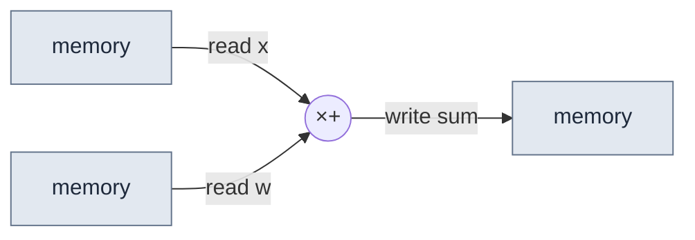
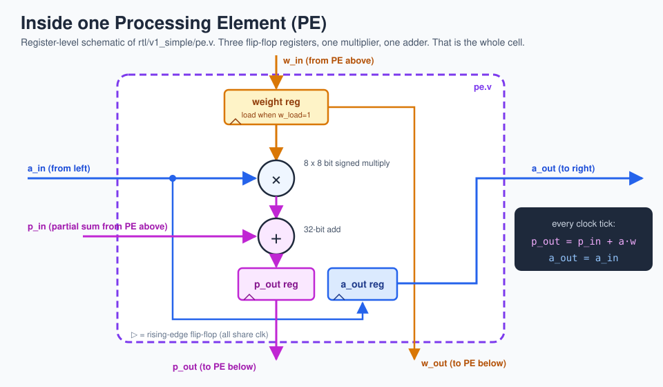

# 4 · Systolic arrays

> **In one sentence:** a systolic array is a grid of tiny identical calculators that each do one multiply-accumulate per clock tick and hand their results straight to their neighbors, like a bucket brigade.

"Systolic" comes from the heart: data is pumped through the grid in rhythm, one beat per clock. H. T. Kung and Charles Leiserson introduced the idea in 1978; Google's TPU brought it to datacenter scale.

## The problem it solves

A normal processor does this for every MAC:



Three memory trips per multiply. Memory trips cost much more energy than the multiply itself.

A systolic array reads each number from memory **once**, then passes it from cell to cell. Every cell it visits does useful work with it.

## One cell: the Processing Element (PE)



Each clock tick, every PE does:

```
p_out = p_in + a_in × w      (add my product to the running total from above)
a_out = a_in                 (pass the input to my right-hand neighbor)
```

and its weight `w` just sits there. That is called **weight-stationary**.

## The grid

Put the PEs in a grid. PE(row k, column n) holds weight `W[k][n]`.

- Input element `x[k]` enters **row k** from the left and slides right.
- The running total for output `y[n]` starts at 0 at the **top of column n** and slides down.
- By the time it falls out of the bottom, column n has added `x[0]·W[0][n] + x[1]·W[1][n] + x[2]·W[2][n] + x[3]·W[3][n]` — exactly `y[n]`.

## The staircase (skew)

There is a catch. The total for column n reaches row k **k cycles** after it started, and the input `x[k]` reaches column n **n cycles** after it entered. For them to meet, row k's input must enter **k cycles late**. So the inputs go in on a staircase:

```
cycle:        0     1     2     3     4
row 0:      x0[0] x1[0] x2[0]   .     .
row 1:        .   x0[1] x1[1] x2[1]   .
row 2:        .     .   x0[2] x1[2] x2[2]
row 3:        .     .     .   x0[3] x1[3] ...
```

That delay network is [`rtl/common/skew.v`](../rtl/common/skew.v). The rule that falls out of it is beautifully simple:

> **Vector v is inside PE(row k, column n) during cycle v + k + n.**

So each input vector crosses the grid as a **diagonal wavefront**:


Outputs leave the bottom on the same staircase (column n is n cycles late), so a second, reversed staircase (**de-skew**) lines them back up before they are stored.

## How long does it take?

For an N × N array and M input vectors:

| Quantity | Formula | TinyTPU (N = 4, M = 8) |
|---|---|---|
| Latency of one vector (in → lined-up out) | 2N − 1 cycles | 7 |
| Cycles for the whole batch | M + 2N − 2 | 14 |
| Useful MACs | M · N² | 128 |
| Peak MACs the grid could have done | N² × cycles | 224 |
| Utilization | M ÷ (M + 2N − 2) | 57 % |

With M = 8 the grid spends a lot of time filling up and draining. With M = 1,000 utilization is above 99 %. **This is why TPUs want large batches.**

Try it yourself: the [systolic array playground](../web/playground.html) lets you add vectors and watch utilization climb. [Lesson 11](11-performance.md) measures this on the real Verilog.

## Other flavors (for later)

| Dataflow | What stays still | Used by |
|---|---|---|
| **Weight-stationary** | weights | TPU v1, TinyTPU |
| Output-stationary | partial sums | many research accelerators (e.g. Berkeley's Gemmini can do both) |
| Row-stationary | a mix, tuned for convolutions | MIT's Eyeriss |

**Next → [5 · Dataflow and energy](05-dataflow-and-energy.md)**
