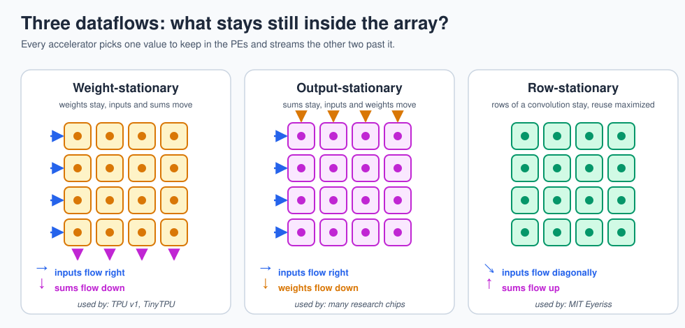
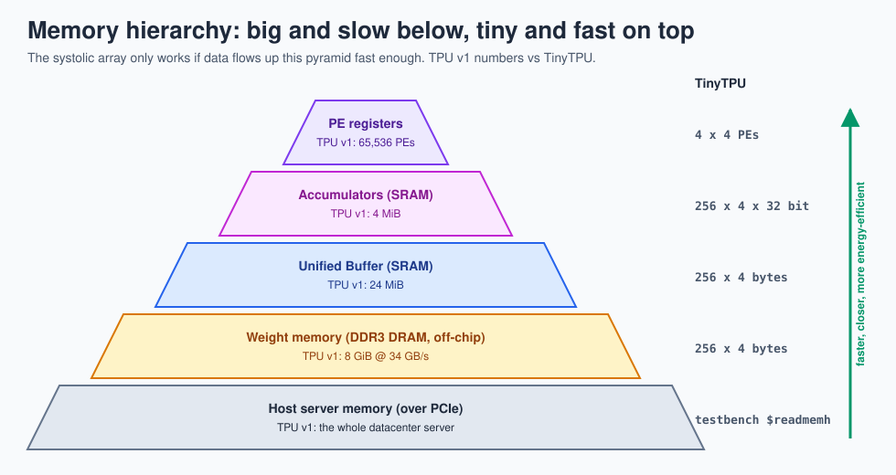

# 5 · Dataflow and energy

> **In one sentence:** in a modern chip, moving a number costs far more energy than doing math on it, so accelerator design is mostly the art of reusing every number you fetch.

## Read the chart

| Operation (45 nm) | Energy | Compared with an 8-bit multiply |
|---|---|---|
| 8-bit integer multiply | 0.2 pJ | 1x |
| 32-bit read from a small on-chip SRAM | 5 pJ | 25x |
| 32-bit read from off-chip DRAM | 640 pJ | 3,200x |

So a design that fetches each operand from DRAM for every multiply would spend over 99.9 % of its energy on moving data. A systolic array fetches each weight **once** and uses it for every vector in the batch; it fetches each input vector **once** and reuses it across all N columns.

## Where each number gets reused in TinyTPU

| Value | Fetched from | Reused | How |
|---|---|---|---|
| weight `W[k][n]` | weight memory, once per `LDW` | once per vector in every following `MMUL` | it sits in PE(k, n) |
| input `x[k]` | Unified Buffer, once per vector | N times (one per column) | it slides right across row k |
| partial sum | never stored mid-way | added to N times (one per row) | it slides down column n |

For a batch of M vectors, TinyTPU does `M × 16` multiplies but reads only `16` weights and `4M` input bytes. At M = 256 that is about 4,096 multiplies per 1,040 bytes read, and all of those reads come from nearby SRAM.

Race it: the [matrix-multiply race](../web/race.html) runs a scalar CPU, a vector unit, and TinyTPU on the same product and prices every operation with these numbers. The vector unit is often faster, the systolic array always cheaper in energy.

## Three dataflows

Every accelerator picks something to keep still:

* **Weight-stationary** (TPU v1, TinyTPU): best when the same weights are used for a big batch.
* **Output-stationary**: each PE owns one output and keeps adding into it; good when outputs are expensive to move.
* **Row-stationary** (Eyeriss): tuned for convolutions so filter rows, image rows, and partial sums all get reused.

[Lab 7](17-labs.md#lab-7--output-stationary-array) asks you to build the output-stationary version and compare.

## The memory pyramid

A TPU is a pyramid of memories, each one smaller, faster, and closer to the multipliers than the one below. The job of the controller (and of the compiler that writes its program) is to keep the top of the pyramid full.

**Next → [6 · Tiling big matrices](06-tiling.md)**
