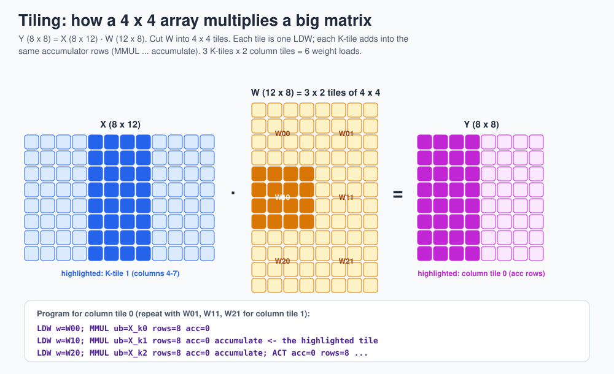

# 6 · Tiling big matrices

> **In one sentence:** a fixed-size array multiplies a matrix of any size by cutting the weights into array-sized tiles, running one tile at a time, and adding the partial answers in the accumulators.



## The recipe

To compute `Y = X · W` with X of size M × K and W of size K × Nout on an N × N array:

1. Cut W into tiles of N × N: `ceil(K / N)` tiles down, `ceil(Nout / N)` tiles across. Pad the edges with zeros.
2. For each **column tile** (a group of N output columns):
   1. For each **K-tile**: `LDW` that tile, then `MMUL` the matching N-wide slice of X. Use `accumulate` on every K-tile after the first.
   2. `ACT` the finished accumulator rows.

The K-tiles add together because a dot product can be split anywhere:

```
y = x[0]·w[0] + x[1]·w[1] + ... + x[11]·w[11]
  = (x[0..3]·w[0..3]) + (x[4..7]·w[4..7]) + (x[8..11]·w[8..11])
       K-tile 0            K-tile 1             K-tile 2
```

## Counting the cost

| Quantity | Formula | Example above (M = 8, K = 12, Nout = 8, N = 4) |
|---|---|---|
| weight loads (`LDW`) | ceil(K/N) × ceil(Nout/N) | 3 × 2 = 6 |
| matrix instructions (`MMUL`) | same | 6 |
| vectors streamed | M × that | 48 |
| useful multiply-accumulates | M × K × Nout | 768 |

## Order matters

There are two loop orders, and they trade memory for reloads:

| Order | Keeps in accumulators | Weight tiles loaded |
|---|---|---|
| column tile outer, K-tile inner (above) | one column tile of results | each exactly once |
| K-tile outer, column tile inner | all output columns at once | each exactly once, but needs more accumulator space |

When the batch M is too big for the Unified Buffer, it gets tiled too, and then weight tiles might have to be reloaded. Choosing tile sizes and loop orders that fit the memories is one of the main jobs of the XLA compiler on real TPUs.

## In TinyTPU

The demo program [`programs/mlp_demo.asm`](../programs/mlp_demo.asm) tiles its first layer (K = 8) into two K-tiles:

```asm
LDW   w=0                            ; K-tile 0
MMUL  ub=0  rows=8  acc=0
LDW   w=4                            ; K-tile 1
MMUL  ub=8  rows=8  acc=0 accumulate ; add into the same rows
```

**Next → [7 · TinyTPU architecture](07-architecture.md)**
