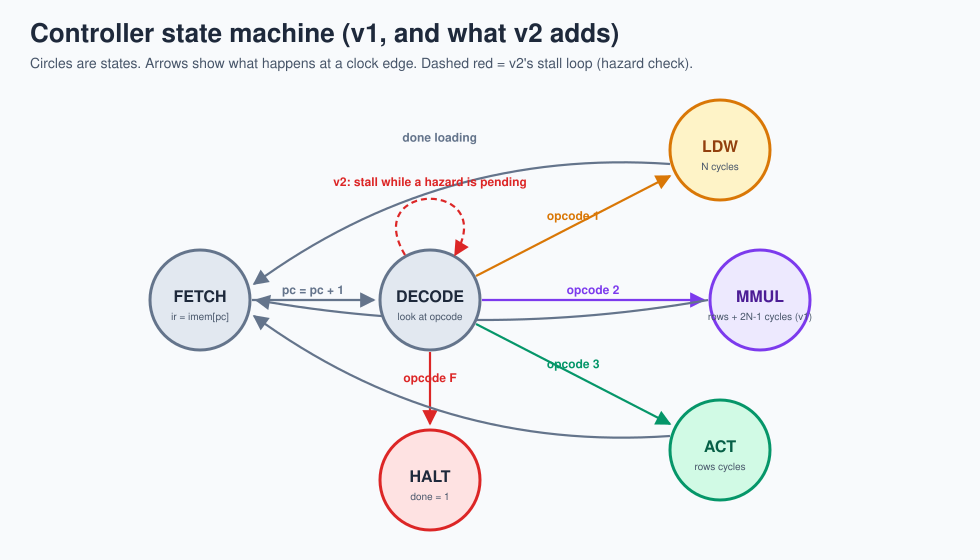
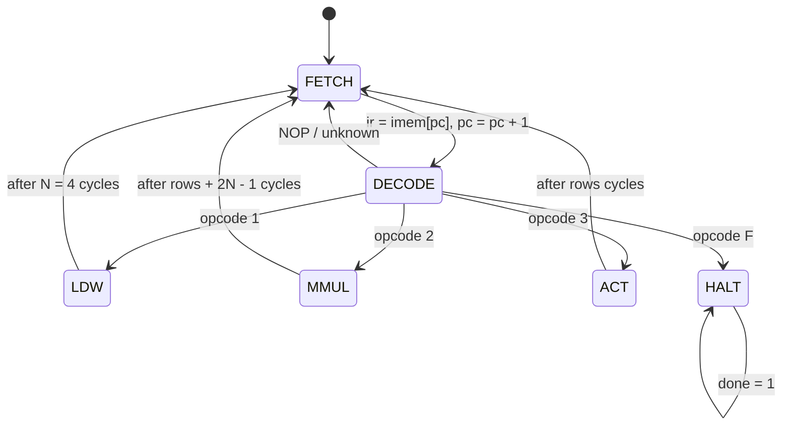

# 7 · TinyTPU architecture

> **In one sentence:** data goes memory → staircase → grid → accumulators → activation → back to memory, and a small controller reads instructions and flips the switches.

## The blocks, in the order data visits them

| Block | File | Job | TPU v1 equivalent |
|---|---|---|---|
| Instruction memory | `tpu_top.v` (`imem`) | holds the program | instructions arrive from the host over Peripheral Component Interconnect Express (PCIe) |
| Controller | `controller.v` (v1) / `controller_pipe.v` (v2) | fetch, decode, count cycles, drive control signals | main control + instruction buffer |
| Weight memory | `tpu_top.v` (`wmem`) | weight rows, 4 bytes each | 8 GiB of off-chip Double Data Rate 3 (DDR3) memory + Weight FIFO |
| Unified Buffer | `tpu_top.v` (`ub`) | input vectors in, results back out | 24 MiB on-chip Static Random-Access Memory (SRAM) |
| Skew | `skew.v` | delays row k by k cycles | "systolic data setup" |
| Systolic array | `systolic_array.v`, `pe.v` | all the multiply-accumulates | Matrix Multiply Unit, 256 × 256 |
| De-skew | `skew.v` (`REVERSE=1`) | lines outputs back up | (part of the accumulator path) |
| Accumulators | `accumulators.v` | 32-bit sums, optional `+=` | 4 MiB of accumulators |
| Activation | `activation.v` | ReLU, shift, clamp to int8 | activation + pooling units |

## Memory map used by the demo program

```mermaid
flowchart TB
    subgraph WM["Weight memory (4 bytes per word)"]
        direction LR
        w0["0-3<br/>W1 top tile"] --- w4["4-7<br/>W1 bottom tile"] --- w8["8-11<br/>W2"]
    end
    subgraph UB["Unified Buffer (one 4-byte vector per word)"]
        direction LR
        u0["0-7<br/>X left half"] --- u8["8-15<br/>X right half"] --- u16["16-23<br/>hidden H"] --- u24["24-31<br/>output Y"]
    end
    subgraph AC["Accumulators (four 32-bit lanes per word)"]
        direction LR
        a0["0-7<br/>layer 1 sums"] --- a8["8-15<br/>layer 2 sums"]
    end
    classDef wt fill:#FEF3C7,stroke:#D97706,color:#92400E
    classDef act fill:#DBEAFE,stroke:#2563EB,color:#1E3A8A
    classDef out fill:#D1FAE5,stroke:#059669,color:#065F46
    classDef ps fill:#FAE8FF,stroke:#C026D3,color:#86198F
    class w0,w4,w8 wt
    class u0,u8 act
    class u16,u24 out
    class a0,a8 ps
```

Byte order: lane 0 is the lowest byte. So Unified Buffer word `0x04030201` is the vector `[1, 2, 3, 4]`.

## The controller's state machine

What each state drives:

| State | Signals the controller raises |
|---|---|
| `LDW` | `w_load = 1` and `wmem_addr = A + 3, A + 2, A + 1, A` (last row first, so row 0 ends up on top after shifting down) |
| `MMUL` | `in_valid = 1` for the first `B` cycles, `ub_rd_addr = A + cycle`; results are written to `acc[C...]` as `out_valid` arrives 7 cycles later |
| `ACT` | `acc_rd_addr = A + cycle`, `ub_wr_en = 1`, `ub_wr_addr = C + cycle`, ReLU and shift from `flags` |

## Timing of one `MMUL` (rows = 3)

| cycle | 0 | 1 | 2 | 3 | 4 | 5 | 6 | 7 | 8 | 9 |
|---|---|---|---|---|---|---|---|---|---|---|
| `in_valid` | **1** | **1** | **1** | 0 | 0 | 0 | 0 | 0 | 0 | 0 |
| Unified Buffer read | A | A+1 | A+2 | | | | | | | |
| row 0 of array gets | x0[0] | x1[0] | x2[0] | | | | | | | |
| row 3 of array gets | | | | x0[3] | x1[3] | x2[3] | | | | |
| `out_valid` | 0 | 0 | 0 | 0 | 0 | 0 | 0 | **1** | **1** | **1** |
| accumulator write | | | | | | | | C | C+1 | C+2 |
| state | MMUL | MMUL | MMUL | MMUL | MMUL | MMUL | MMUL | MMUL | MMUL | MMUL → FETCH |

`in_valid` travels through a 7-bit shift register (`valid_pipe` in `tpu_top.v`) so it pops out exactly when the matching data does. This "valid bit rides alongside the data" trick is everywhere in real hardware.

## A real waveform

This is not a drawing: it is rendered straight from the simulation's waveform file (`make diagrams` regenerates it). The staircase in the four row inputs is the skew; the 7-cycle gap before `result valid` is the 2N − 1 latency.

## Where the 92 cycles go

| Instruction | Cycles | Why |
|---|---|---|
| each instruction | 2 | FETCH + DECODE |
| `LDW` | + 4 | one weight row per cycle |
| `MMUL rows=8` | + 15 | 8 vectors in + 7 cycles to drain |
| `ACT rows=8` | + 8 | one row per cycle |
| `HALT` | + 1 | set `done` |

3 × LDW (6) + 3 × MMUL (17) + 2 × ACT (10) + HALT (3) = **92**, exactly what the simulation reports.

Useful work: 3 × 8 × 16 = 384 multiply-accumulates in 92 cycles, versus a peak of 16 × 92 = 1,472. About **26 % utilization**. Real TPUs get much closer to 100 % by overlapping instructions (loading the next weights while the current multiply runs) and using big batches. That is exactly what [v2](10-pipelining-v2.md) does.

**Next → [8 · RTL walkthrough](08-rtl-walkthrough.md)**
