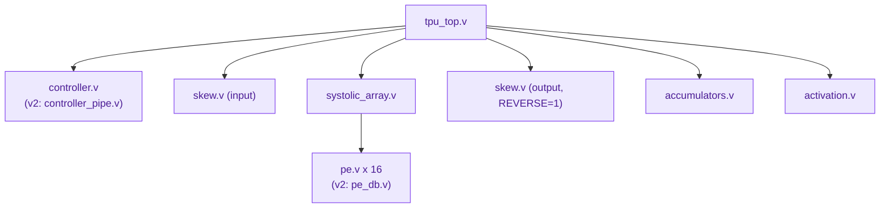
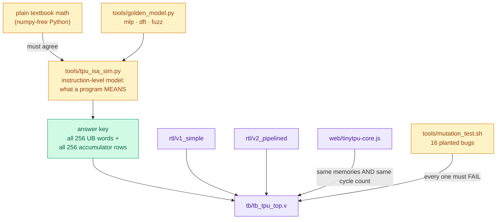

# 8 · RTL walkthrough

The repo has two chips that share three files:

```
rtl/common/        skew.v  accumulators.v  activation.v
rtl/v1_simple/     pe.v  systolic_array.v  controller.v  tpu_top.v
rtl/v2_pipelined/  pe_db.v  systolic_array_db.v  controller_pipe.v  tpu_top.v
```

This lesson walks through v1. [Lesson 10](10-pipelining-v2.md) covers what v2 changes.

> **In one sentence:** Register-Transfer Level (RTL) code describes which values get stored in registers on each clock edge and what logic sits between them; here is every TinyTPU file, smallest first.

## How to read Verilog in 60 seconds

| You see | It means |
|---|---|
| `always @(posedge clk)` + `<=` | flip-flops: these values update together at the clock edge |
| `assign x = ...` or `always @(*)` | plain wires/gates: the value follows its inputs instantly |
| `parameter N = 4` | a knob you set when you build the hardware (not at run time) |
| `genvar` + `generate for` | "stamp out N copies of this hardware" |
| `signed [7:0]` | an 8-bit two's-complement number (−128 to 127) |
| `x[k*8 +: 8]` | "the 8 bits starting at bit k·8", i.e. lane k of a packed vector |



## 1. `v1_simple/pe.v`: the cell (about 15 lines that matter)

```verilog
always @(posedge clk) begin
    if (w_load) w_out <= w_in;          // weight shift register
    a_out <= a_in;                       // pass activation right
    p_out <= p_in + a_in * w_out;        // the MAC
end
```

Three registers: `w_out` (the stored weight, amber), `a_out` (blue), `p_out` (magenta). See [the schematic](../diagrams/pe_schematic.svg).

**Detail worth noticing:** `p_in` is 32 bits and `a_in`, `w_out` are 8 bits. Verilog sizes an expression by its widest operand, and since all three are `signed`, the 8-bit values are sign-extended to 32 bits *before* multiplying. If any one of them were unsigned, the whole expression would become unsigned and negative weights would silently break. The mutation test and the random negative numbers in the golden model exist to catch exactly this class of bug.

**Weight loading:** when `w_load` is high for 4 cycles, weights shift *down* each column like a conveyor belt. The controller therefore sends the **last** row first. After 4 shifts, row 0's weights sit in the top row.

## 2. `v1_simple/systolic_array.v`: stamping out the grid

```verilog
for (r = 0; r < N; r = r + 1) begin : row
  for (c = 0; c < N; c = c + 1) begin : col
    pe u_pe (
      .a_in (a_bus[(r*(N+1)+c  )*DW +: DW]),   // from the left neighbor
      .a_out(a_bus[(r*(N+1)+c+1)*DW +: DW]),   // to the right neighbor
      .p_in (p_bus[( r   *N+c)*AW +: AW]),     // from the neighbor above
      .p_out(p_bus[((r+1)*N+c)*AW +: AW]),     // to the neighbor below
      ...
```

The buses are flattened 1-D bit vectors because plain Verilog-2001 handles those most portably. Think of `a_bus` as N rows × (N+1) "gaps between cells": gap 0 is the left edge, gap N is off the right edge.

Only neighbors are wired together. **No wire is longer than one cell.** This is why systolic arrays reach high clock speeds and scale to 256 × 256: making the array bigger never makes any wire longer.

## 3. `common/skew.v`: the staircase

```verilog
localparam D = (REVERSE != 0) ? (N - 1 - k) : k;   // how many cycles to delay lane k
```

Lane k gets a shift register of length D. Used twice in `tpu_top.v`: once on the input (lane k waits k cycles) and once on the output (column k waits N−1−k cycles), so every vector enters as a diagonal and leaves as a straight line. Total latency: k + (N−1−k) + N = 2N − 1 for every lane.

## 4. `common/accumulators.v`: memory that can add

```verilog
assign sum[l*AW +: AW] = (accumulate ? old[l*AW +: AW] : 0) + wr_data[l*AW +: AW];
always @(posedge clk) if (wr_en) mem[wr_addr] <= sum;
```

With `accumulate = 1`, a second `MMUL` into the same addresses *adds* to the stored results. That is how a 4 × 4 array multiplies an 8-row weight matrix: split it into two 4-row tiles and add. TPU v1 did the same thing to fit any matrix onto its 256 × 256 array.

## 5. `common/activation.v`: squash back to 8 bits

```verilog
wire signed [AW-1:0] r = (relu && v < 0) ? 0 : v;       // ReLU
wire signed [AW-1:0] s = r >>> shift;                  // arithmetic shift (keeps the sign)
assign q_out = (s > 127) ? 127 : (s < -128) ? -128 : s[7:0];   // saturate
```

`>>>` (arithmetic) versus `>>` (logical) matters for negative numbers: −8 `>>>` 1 is −4, but −8 `>>` 1 is a huge positive number. One of the planted mutants swaps them; the test catches it.

## 6. `v1_simple/controller.v`: the conductor

Two `always` blocks, the standard way to write a state machine:

* `always @(*)`: given the current state and counter, what should every control wire be **right now**?
* `always @(posedge clk)`: what are the next state and counter?

The instruction fields are just slices of the instruction register:

```verilog
wire [3:0] op    = ir[31:28];
wire [7:0] fA    = ir[27:20];
wire [7:0] fB    = ir[19:12];
wire [7:0] fC    = ir[11:4];
wire [3:0] flags = ir[3:0];
```

## 7. `v1_simple/tpu_top.v`: the wiring harness

Instantiates everything, owns the three memories, and contains the one trick that ties timing together:

```verilog
always @(posedge clk) valid_pipe <= {valid_pipe[LAT-2:0], in_valid};
assign out_valid = valid_pipe[LAT-1];      // LAT = 2N - 1
```

## Watching it in GTKWave

`make wave` opens `build/tpu.vcd` with the layout in `sim/tpu.gtkw`. Good signals to watch:

| Signal | What you'll see |
|---|---|
| `dut.u_ctrl.state` | 0 FETCH, 1 DECODE, 2 LDW, 3 MMUL, 4 ACT, 5 HALT |
| `dut.u_ctrl.pc` | which instruction is running |
| `dut.in_valid`, `dut.out_valid` | the 7-cycle gap between a vector going in and its result coming out |
| `dut.a_skewed` | the staircase: lanes change on consecutive cycles |
| `dut.result_vec` | lined-up output vectors |

## How it is verified



| Layer | Command | What it proves |
|---|---|---|
| Demo programs | `make`, `make dft` | the neural network and the Fourier transform give the textbook answers on both versions |
| Random programs | `make fuzz` | 200 random programs per version, with read-after-write dependencies made likely, match the instruction-level model word for word |
| Array sizes | `make scale` | the Verilog really is parameterized: N = 2, 4, 8, 16 on both versions |
| Browser model | `make jscheck` | the JavaScript simulator is cycle-exact with the Verilog |
| Mutation test | `make mutants` | 16 realistic planted bugs (10 in v1/common, 6 v2 hazards) are all caught |
| Everything | `make test` | all of the above |

The rule behind all of it: **if a planted bug survives, the fix is a stronger test, never a weaker check.** The v2 hazard "ACT reads results still in flight" originally survived because random addresses almost never make one instruction read what the previous one wrote. The fuzzer was changed to make those dependencies common, and the mutant died.

**Next → [9 · Instructions and programming](09-instruction-set.md)**
