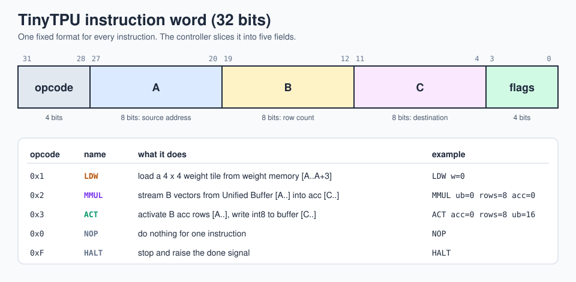
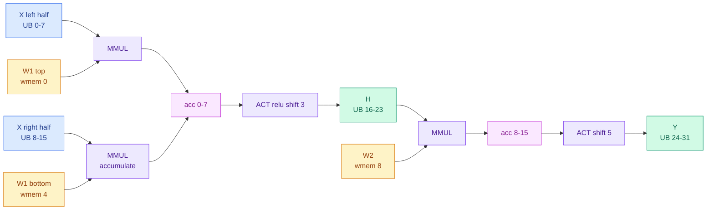
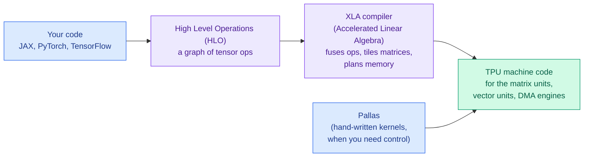

# 9 · Instructions and programming

> **In one sentence:** TinyTPU has five instructions and you write them in a tiny assembly language; real TPUs are programmed the same way underneath, but a compiler writes the instructions for you.

## Part A · TinyTPU's instruction set



### The assembly language

| Instruction | Fields | Does |
|---|---|---|
| `LDW w=A` | weight address | load weight rows `A..A+3` into the grid |
| `MMUL ub=A rows=B acc=C [accumulate]` | source, count, destination | multiply `B` vectors from the Unified Buffer; store (or add) results in the accumulators |
| `ACT acc=A rows=B ub=C [relu] shift=S` | source, count, destination | ReLU (optional), divide by 2^S, clamp to 8 bits, store in the Unified Buffer |
| `NOP` | none | wait |
| `HALT` | none | stop, raise `done` |

Comments start with `;` or `#`.

### Walk through the demo program

[`programs/mlp_demo.asm`](../programs/mlp_demo.asm) runs a 2-layer neural network: 8 samples, 8 features, 4 hidden neurons, 4 outputs.

```asm
; Layer 1: H = ReLU(X @ W1) >> 3      (W1 is 8 x 4: too tall, so two tiles)
LDW   w=0                              ; W1 rows 0..3
MMUL  ub=0  rows=8  acc=0              ; acc  = X[:, 0:4] @ W1[0:4, :]
LDW   w=4                              ; W1 rows 4..7
MMUL  ub=8  rows=8  acc=0 accumulate   ; acc += X[:, 4:8] @ W1[4:8, :]
LDW   w=8                              ; W2 early: on v2 it overlaps the drain
ACT   acc=0 rows=8  ub=16 relu shift=3

; Layer 2: Y = (H @ W2) >> 5
MMUL  ub=16 rows=8  acc=8
ACT   acc=8 rows=8  ub=24 shift=5
HALT
```



### Assemble it yourself

```bash
python3 tools/tpu_asm.py programs/mlp_demo.asm build/imem.hex
```

```
    0: 10000000   LDW   w=0
    1: 20008000   MMUL  ub=0 rows=8 acc=0
    2: 10400000   LDW   w=4
    3: 20808001   MMUL  ub=8 rows=8 acc=0 accumulate
    4: 10800000   LDW   w=8
    5: 30008107   ACT   acc=0 rows=8 ub=16 relu shift=3
    6: 21008080   MMUL  ub=16 rows=8 acc=8
    7: 3080818a   ACT   acc=8 rows=8 ub=24 shift=5
    8: f0000000   HALT
```

Decode one by hand: `3080818a` → opcode `3` (ACT), A = `0x08`, B = `0x08`, C = `0x18` (24), flags = `0xa` = `1010` → shift = `101` = 5, ReLU bit = 0. ✔

### Try it in the browser

The [whole-chip simulator](../web/chip.html) assembles programs as you type and runs them on a cycle-exact model of the Verilog, with the controller state, skew registers, array, and every memory on screen.

### Writing your own program: checklist

1. Put each weight tile in weight memory as 4 rows of 4 bytes (`W[k][0..3]` in word `base + k`).
2. Put input vectors in the Unified Buffer, one 4-byte vector per word.
3. If the input has more than 4 features, split it into 4-wide chunks and use `accumulate` on the second and later `MMUL`s.
4. Pick a `shift` so the largest expected sum fits in −128..127 after dividing by 2^shift.
5. Always end with `HALT`.

## Part B · How Google's TPU v1 was programmed

TPU v1 was a coprocessor on a PCIe card. The host CPU sent it instructions. The TPU v1 paper describes about a dozen instructions, five of which do the real work. TinyTPU's instructions are shrunken copies:

| TPU v1 instruction | What it did | TinyTPU equivalent |
|---|---|---|
| `Read_Host_Memory` | copy input data from the host into the Unified Buffer | the testbench's `$readmemh` |
| `Read_Weights` | stream weights from DDR3 into the Weight FIFO | `LDW` |
| `MatrixMultiply` / `Convolve` | run a batch through the systolic array into the accumulators | `MMUL` |
| `Activate` | nonlinearity (ReLU, sigmoid...) + optional pooling, back into the Unified Buffer | `ACT` |
| `Write_Host_Memory` | copy results back to the host | testbench reads `dut.ub` |

The paper calls this a Complex Instruction Set Computer (CISC) style: each instruction does a lot of work (thousands of cycles), and a four-stage pipeline overlaps them.

## Part C · How modern TPUs are programmed

Nobody writes TPU instructions by hand anymore. You write normal array code and a compiler maps it onto the systolic arrays.



"Tiling matrices" in that picture is exactly what our demo did by hand with two `MMUL`s and `accumulate`.

### Try a real TPU for free

Google Colab offers a TPU runtime (**Runtime → Change runtime type → TPU**; availability varies). Paste this in a cell:

```python
import jax, jax.numpy as jnp

print(jax.devices())                     # should list TPU devices

@jax.jit
def layer(x, w):
    return jax.nn.relu(x @ w)            # the same thing as MMUL + ACT relu

x = jnp.ones((1024, 1024), dtype=jnp.bfloat16)
w = jnp.ones((1024, 1024), dtype=jnp.bfloat16)
y = layer(x, w).block_until_ready()
print(y.shape, y.dtype)

# peek at the compiler's view: the matrix multiply and the ReLU as HLO ops
print(layer.lower(x, w).as_text()[:1500])
```

In the printed HLO, look for a `dot` (the matrix multiply) and a `maximum` against 0 (the ReLU). The compiler has turned your one line into work for the systolic arrays, the same job TinyTPU's `MMUL` and `ACT` do.

### On the edge: Coral Edge TPU

The Edge TPU (sold as Coral boards and USB sticks) runs 8-bit TensorFlow Lite models. The workflow is: train a model, quantize it to int8, run it through the `edgetpu_compiler`, and it maps supported layers onto the chip. Exactly the quantization idea from [lesson 2](02-why-matrix-math.md).

**Next → [10 · Pipelining: TinyTPU v2](10-pipelining-v2.md)**
