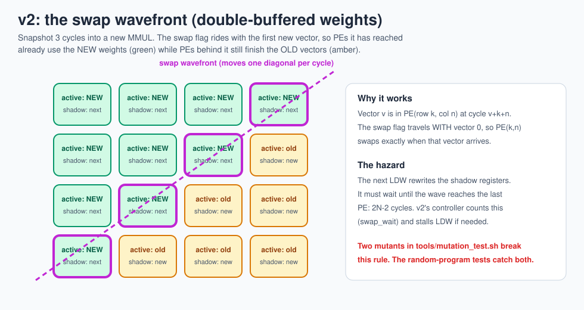
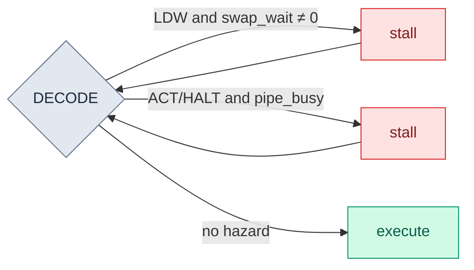

# 10 · Pipelining: TinyTPU v2

> **In one sentence:** v2 runs the same programs as v1 but lets the next instruction start while the previous one's results are still flowing through the array, using double-buffered weights and a small hazard checker to stay correct.

Both bars above come from the real Verilog running `programs/mlp_demo.asm`: **92 cycles on v1, 77 on v2**, identical results.

## Where v1 wastes time

In v1, `MMUL` waits until its last result has left the array (2N − 1 = 7 extra cycles), and `LDW` stops the whole array while it shifts in new weights. The array sits idle during both.

**Watch it:** the [chip simulator](../web/chip.html) and the [waveform viewer](../web/wave.html) both have a v1 / v2 switch. The v2 model is checked cycle-for-cycle against `rtl/v2_pipelined` by `make jscheck`, so you can step through stalls and the swap wavefront one clock at a time.

## The three changes in v2

| Change | File | Idea |
|---|---|---|
| **Shadow weights** | [`rtl/v2_pipelined/pe_db.v`](../rtl/v2_pipelined/pe_db.v) | Each PE has two weight registers. `LDW` fills the *shadow* one while the *active* one keeps computing. TPU v1 did exactly this. |
| **Swap flag rides with the data** | [`pe_db.v`](../rtl/v2_pipelined/pe_db.v), [`tpu_top.v`](../rtl/v2_pipelined/tpu_top.v) | The first vector of each `MMUL` carries a 1-bit flag through the skew and across the array. Each PE swaps shadow → active at the exact cycle that vector arrives. |
| **Metadata pipeline** | [`tpu_top.v`](../rtl/v2_pipelined/tpu_top.v) | Each vector's destination address and `accumulate` bit travel down a 7-stage pipeline next to it, so the controller can move on immediately. |

## The hazards (and the scoreboard that prevents them)

Overlapping instructions is only safe if no instruction sees data that isn't ready yet. v2's controller checks three rules in `DECODE` and stalls until they hold ([`controller_pipe.v`](../rtl/v2_pipelined/controller_pipe.v)):

| Hazard | What would go wrong | Rule |
|---|---|---|
| `LDW` too soon after `MMUL` | new weights overwrite the shadow register before the far corner PE has swapped, so old vectors use half-new weights | wait until `swap_wait` counts down (2N − 2 cycles after the `MMUL` started) |
| `ACT` too soon after `MMUL` | reads accumulator rows whose results are still inside the array | wait until the metadata pipeline is empty (`pipe_busy = 0`) |
| `HALT` too soon | the testbench would read memories before the last results land | same as `ACT` |

This is the same idea as the hazard detection in a pipelined CPU: a small "scoreboard" that knows which results are still in flight.

## A compiler trick in the demo program

The demo program issues `LDW w=8` (the layer-2 weights) **before** the first `ACT`. `ACT` never touches the array, so on v2 those weights stream into the shadow registers while layer-1 results are still draining. On v1 the order makes no difference. Reordering independent instructions to hide latency is a big part of what the XLA compiler does on real TPUs.

## How we know v2 is correct

Overlapping hardware is where subtle bugs live, so v2 gets the heaviest testing in the repo:

* The **instruction-level model** ([`tools/tpu_isa_sim.py`](../tools/tpu_isa_sim.py)) defines what every program *means*, with no timing at all. Both chip versions must end with exactly its memories: all 256 Unified Buffer words and all 256 accumulator rows.
* **Random programs** (`make fuzz`, 200 per version) are generated with dependencies made likely on purpose: `ACT` reading rows the last `MMUL` just wrote, `LDW` right after a one-vector `MMUL`, and so on. Purely random addresses almost never collide, so they would miss exactly these bugs.
* **Mutation testing** plants 6 v2-specific bugs (remove each hazard rule, shorten the swap wait, drop the swap flag, stop carrying the address). The tests must catch every one, and they do.

**Next → [11 · Performance](11-performance.md)**
