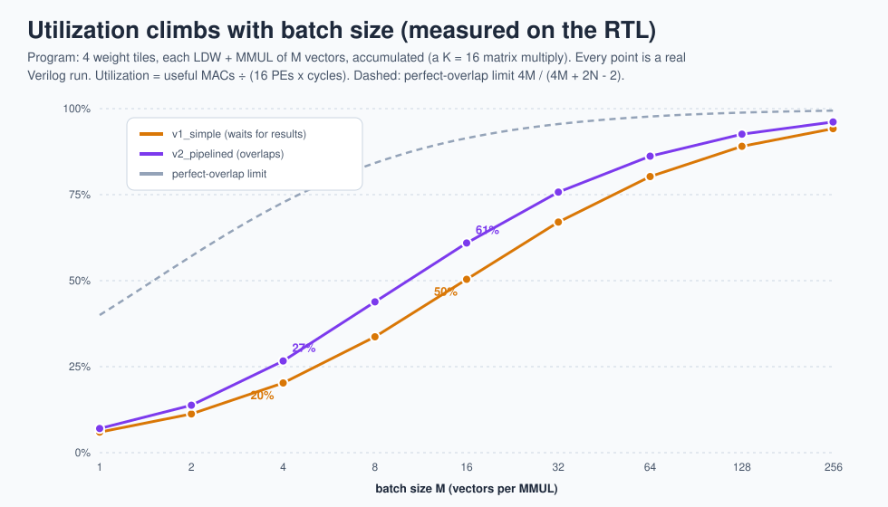
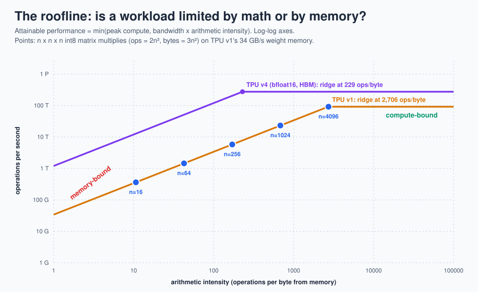

# 11 · Performance: utilization and the roofline

> **In one sentence:** a TPU is only fast when two things are true: the array is kept busy (big batches, overlapped instructions), and memory can feed it fast enough (high arithmetic intensity).

## Utilization, measured on the RTL

Every point on this chart is a real Verilog simulation of a 16-deep matrix multiply (four accumulated weight tiles) with M vectors per tile:

| Vectors per tile (M) | v1 utilization | v2 utilization |
|---|---|---|
| 4 | 20 % | 27 % |
| 16 | 50 % | 61 % |
| 64 | 80 % | 86 % |
| 255 | 94 % | 96 % |

Two lessons:

1. **Batch size matters more than anything else.** The array needs 2N − 2 cycles to fill and drain no matter how many vectors you send, so few vectors means mostly-empty cycles.
2. **Overlap helps most when batches are small.** v2's gain is biggest on the left side of the chart, where v1 spends a large share of its time waiting for results to drain.

Regenerate this chart yourself with `make diagrams`; it re-runs all 18 simulations.

## The roofline

**Arithmetic intensity** = operations ÷ bytes fetched from memory. The **ridge point** = peak compute ÷ memory bandwidth. Left of the ridge, a job is **memory-bound** (waiting for data); right of it, **compute-bound** (every multiplier busy).

| Chip | Peak | Memory bandwidth | Ridge point |
|---|---|---|---|
| TPU v1 (int8, DDR3 weight memory) | 92 × 10¹² ops/s | 34 GB/s | ≈ 2,700 ops/byte |
| TPU v4 (bfloat16, HBM) | 275 × 10¹² ops/s | ≈ 1,200 GB/s | ≈ 230 ops/byte |
| TinyTPU at 100 MHz | 3.2 × 10⁹ ops/s (16 MACs × 2 ops) | 400 MB/s (one 4-byte vector per cycle) | 8 ops/byte |

(The TPU v1 paper counts a multiply-accumulate as two operations, as here; some sources count it as one and get half the ridge value.)

TPU v1's ridge was very far right because its weights lived in slow DDR3. The paper found several of Google's production networks were memory-bound for exactly this reason, which is why TPU v2 moved to High Bandwidth Memory (HBM).

Play with this in the [roofline explorer](../web/explorers.html).

## Putting numbers on TinyTPU

At a 100 MHz clock (easily reachable on an FPGA or in 130 nm silicon), the neural-network demo would take 92 cycles = 0.92 µs on v1 and 0.77 µs on v2, doing 384 multiply-accumulates. TPU v1 does 65,536 multiply-accumulates **every** cycle at 700 MHz.

**Next → [12 · From RTL to silicon](12-rtl-to-silicon.md)**
