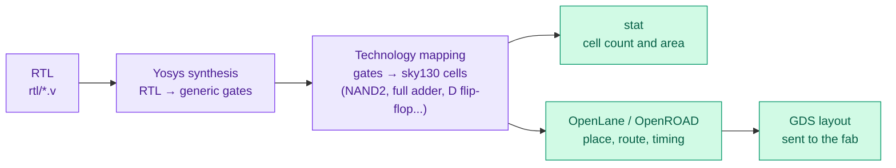

# 12 · From RTL to silicon

> **In one sentence:** synthesis turns the Verilog into a list of real logic cells from a chip factory's library, which tells you how big (and roughly how fast and power-hungry) the design would be as a real chip.



## Real numbers: TinyTPU in SkyWater 130 nm


From [`tools/synth_report.sh`](../tools/synth_report.sh), mapping onto the open-source `sky130_fd_sc_hd` standard-cell library (data in [`data/synth.csv`](../data/synth.csv)):

| Design | Cells | Flip-flops | Area |
|---|---|---|---|
| one PE (v1) | 808 | 48 | 6,867 µm² |
| one PE (v2, shadow weight + swap flag) | 813 | 57 | 7,236 µm² |
| 2 × 2 array (v1 / v2) | 1,625 / 1,736 | 128 / 162 | 0.014 / 0.015 mm² |
| 4 × 4 array (v1 / v2) | 7,683 / 8,179 | 640 / 780 | 0.063 / 0.068 mm² |
| 8 × 8 array (v1 / v2) | 32,439 / 34,510 | 2,816 / 3,384 | 0.273 / 0.293 mm² |

Things to notice:

* **Area grows with N².** Double N, quadruple the area. That is the price of the systolic array's N² multipliers.
* **Most of a PE is the multiplier and the 32-bit adder.** 48 flip-flops out of 808 cells; the rest is arithmetic.
* **Synthesis is clever.** 16 PEs × 48 flip-flops would be 768, but the 4 × 4 array has only 640. Yosys noticed that some bits can never differ (for example, the top row's partial sums are just one 16-bit product, so their upper bits are all copies of the sign bit) and merged them. Also, the right-most column's outgoing activations go nowhere, so those registers were removed.
* **Scaling to TPU v1 size in 130 nm is absurd**: 65,536 PEs × 6,867 µm² ≈ 450 mm² for the array alone. TPU v1 used a 28 nm process, where each transistor is roughly 20x smaller in area, and a more optimized multiplier.

## Run it on your machine

```bash
sudo apt install -y yosys
# point at the sky130 standard-cell library (typical path shown)
export SKY130_LIB=~/pdk/sky130A/libs.ref/sky130_fd_sc_hd/lib/sky130_fd_sc_hd__tt_025C_1v80.lib
make synth            # writes data/synth.csv
make diagrams         # redraws diagrams/synth_area.svg from it
```

Without the library, the script still runs and reports generic gate counts.

## What it would take to tape out

| Step | For TinyTPU |
|---|---|
| Shrink the memories | 256-entry memories become thousands of flip-flops; use 16 entries, or SRAM macros |
| Add a host interface | a Serial Peripheral Interface (SPI) port so a microcontroller can load programs and read results |
| Meet timing | the 8 × 8 multiply feeding a 32-bit add in one cycle limits the clock; add a pipeline register if needed |
| Fit a Tiny Tapeout tile | a 2 × 2 array with tiny memories is a realistic first target |

See [Lab 6](17-labs.md#lab-6--toward-silicon).

**Next → [13 · Real TPUs](13-real-tpus.md)**
