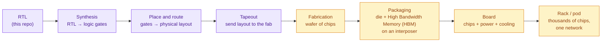
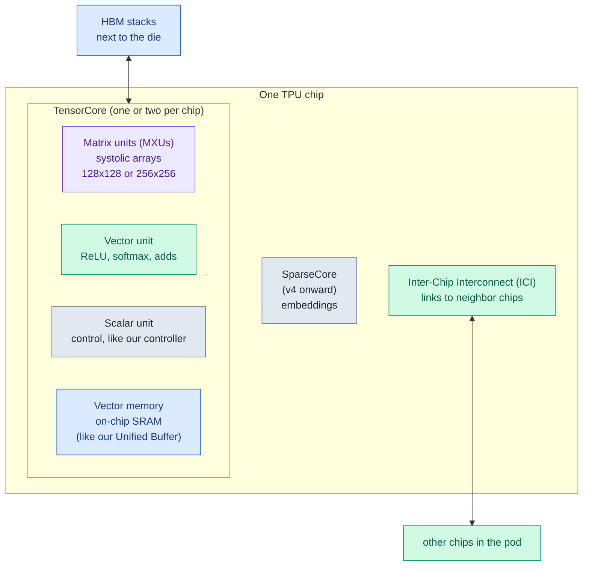
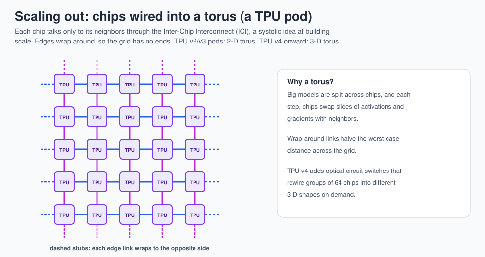
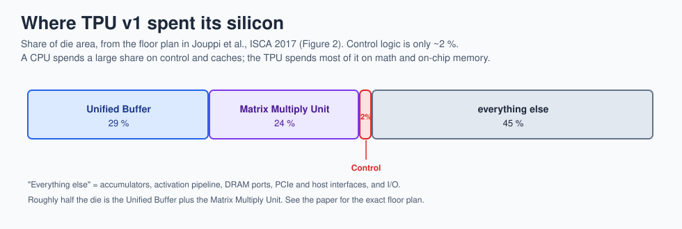

# 13 · Real TPUs

> **In one sentence:** Google has built eight generations of TPUs since 2015, from a single inference card to "pods" of thousands of liquid-cooled chips, and the systolic array is still at the center of every one.

## From RTL to a real chip

TinyTPU has already taken the first step: [lesson 12](12-rtl-to-silicon.md) synthesizes it onto real SkyWater 130 nm cells with Yosys. The rest of the path (OpenLane place-and-route, Tiny Tapeout) is [Lab 6](17-labs.md#lab-6--toward-silicon).

## The generations

Peak numbers are per chip and come from Google's papers, blog posts, and Cloud documentation (links below). Treat them as approximate; always check the source for your exact use.

| Generation | Public | Built for | Headline numbers | What was new |
|---|---|---|---|---|
| **TPU v1** | used 2015, revealed 2016, paper 2017 | inference | 256 × 256 int8 array, 700 MHz, 92 tera-operations/s, 28 nm, 8 GiB DDR3, 75 W design power | the first one; a PCIe card for servers |
| **TPU v2** | 2017 | training + inference | ≈45 teraFLOPS, 16 GiB HBM | bfloat16 numbers, High Bandwidth Memory, chips linked into 256-chip "pods" |
| **TPU v3** | 2018 | training | ≈123 teraFLOPS, 32 GiB HBM | liquid cooling, 1,024-chip pods |
| **TPU v4** | 2021 (paper 2023) | training | ≈275 teraFLOPS, 32 GiB HBM | optical circuit switches, 4,096-chip pods, SparseCores for embeddings |
| **TPU v5e / v5p** | 2023 | cost-efficient / high-performance | v5e ≈197 teraFLOPS; v5p ≈459 teraFLOPS, 95 GB HBM | split into an efficient and a big version |
| **TPU v6e (Trillium)** | 2024 | training + inference | ≈918 teraFLOPS bfloat16, 32 GB HBM | 256 × 256 matrix units again, big efficiency jump |
| **TPU7x (Ironwood)** | 2025 | inference first | ≈4,614 teraFLOPS 8-bit float, 192 GB HBM, pods up to 9,216 chips | built for the "age of inference" |
| **TPU 8t / TPU 8i** | announced April 2026 | 8t training, 8i inference | 8t superpods of up to 9,600 chips; 8i with 384 MB on-chip SRAM | first generation with two separate designs from the start |
| **Edge TPU** | 2018–2019 | tiny devices | ≈4 tera-operations/s int8 at ≈2 W | a TPU you can hold; Coral boards and USB sticks |

## Anatomy of a modern TPU chip

Every TinyTPU block has a grown-up version here: the Matrix Multiply Unit (MXU) is our systolic array, the vector unit is our activation block, vector memory is our Unified Buffer, and the scalar unit plays the controller.

## Scaling out: pods

From TPU v2 onward, chips are wired directly to their neighbors into pods. The network itself is systolic in spirit: every chip passes data to its neighbors, and big models are split so that each chip works on a slice and trades partial results with the chips next to it.

## Where TPU v1 spent its silicon

Compare with [lesson 12](12-rtl-to-silicon.md), where TinyTPU's own area comes from real synthesis.

## Photo tour (links to the original images)

The photos are copyrighted by their owners, so this repo links to them instead of copying them.

| Look at | Where | What to notice |
|---|---|---|
| TPU v1 board and a datacenter rack | [Google Cloud blog: "An in-depth look at Google's first TPU" (2017)](https://cloud.google.com/blog/products/ai-machine-learning/an-in-depth-look-at-googles-first-tensor-processing-unit-tpu) | A PCIe card that slid into a disk-drive slot. Also shows the floor plan: the Matrix Multiply Unit and Unified Buffer take most of the die. |
| TPU v1 die floor plan and block diagram | [Jouppi et al., ISCA 2017 paper (arXiv 1704.04760)](https://arxiv.org/abs/1704.04760), Figures 1–3 | Compare its block diagram with [ours](../diagrams/tpu_block_diagram.svg): same boxes, same arrows. |
| Photos of several generations | [Wikipedia: Tensor Processing Unit](https://en.wikipedia.org/wiki/Tensor_Processing_Unit) (freely licensed images, check each file's license) | v2 and v3 boards: four chips per board, with thick copper heat sinks on v2 and liquid-cooling pipes on v3. |
| TPU v4 system and optical switches | [Jouppi et al., ISCA 2023 paper (arXiv 2304.01433)](https://arxiv.org/abs/2304.01433) | How 4,096 chips become one machine. |
| Current Cloud TPU system diagrams | [Google Cloud: TPU system architecture](https://cloud.google.com/tpu/docs/system-architecture-tpu-vm) | Chips, hosts, slices, and pods for today's versions. |
| TPU 8t and 8i chips (package shots, Hot Chips 2026) | [ServeTheHome: Google's TPU v8s at Hot Chips 2026](https://www.servethehome.com/googles-tpuv8s-for-training-and-inference-at-hot-chips-2026/) | Count the HBM stacks around each die: the training chip and inference chip are laid out differently. |
| Edge TPU hardware | [Coral products](https://coral.ai/products/) | USB Accelerator and Dev Board: the same idea at about 2 W. |

**Scavenger hunt:** in any package photo, find (1) the big compute die in the middle, (2) the rectangular HBM stacks right next to it, and (3) the substrate around them carrying thousands of power and signal connections. In the TPU v1 floor plan, estimate what fraction of the die is multipliers + buffers versus control. (The paper says control is only about 2 %.)

**Next → [14 · New applications](14-new-applications.md)**
