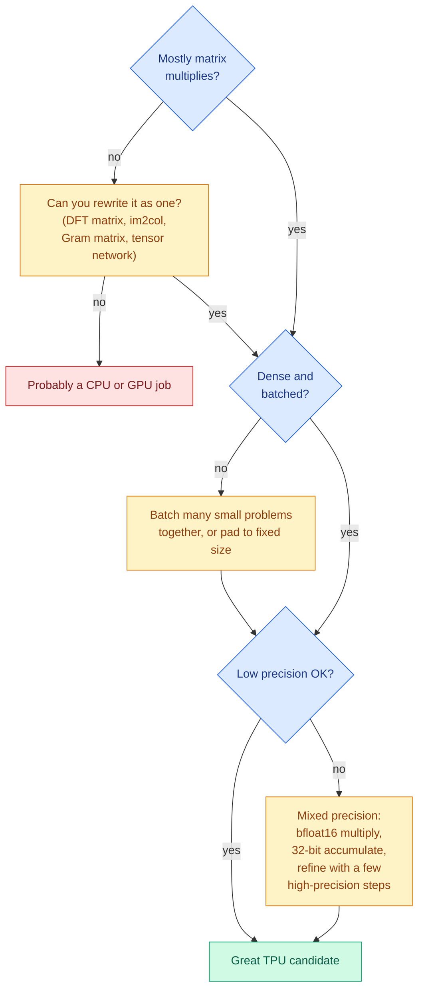
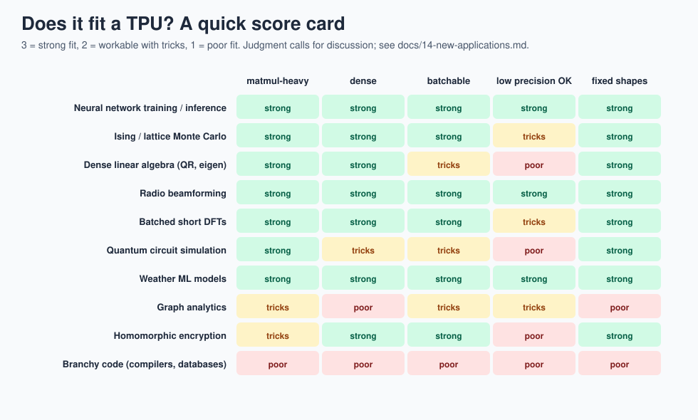

# 14 · New applications

> **In one sentence:** a TPU is really a "dense linear algebra engine", so anything you can rewrite as big, regular matrix multiplies at modest precision is a candidate, even if it has nothing to do with neural networks.

## Step 1 · Does my problem fit a TPU?

Score your idea against this checklist. The more ✅, the better the fit.

| Question | ✅ fits well | ❌ fits badly |
|---|---|---|
| Is the heavy part a matrix multiply (or convolution, or can it be rewritten as one)? | yes, most of the time | lots of `if` statements, pointer chasing, irregular graphs |
| Is the data **dense**? | mostly nonzero numbers | mostly zeros (sparse) |
| Is it **big and batched**? | thousands of rows at once | one small problem at a time |
| Is low precision OK? | 8-bit or bfloat16 is fine | needs 64-bit double precision everywhere |
| Are shapes fixed in advance? | same sizes every step | sizes change constantly |
| High reuse (arithmetic intensity)? | each number used many times | each number used once, then thrown away |



### The roofline, in one picture of words

Every chip has a peak compute rate (operations per second) and a peak memory bandwidth (bytes per second). Their ratio is the **ridge point**: how many operations you must do per byte fetched to keep the multipliers busy.

```
performance
    ▲
    │                 ┌──────────────────── compute roof (all multipliers busy)
    │               ╱
    │             ╱   ← memory roof: you're waiting on memory
    │           ╱
    │         ╱
    └───────┼────────────────────────────► arithmetic intensity (ops per byte)
          ridge point
```

Your workload's arithmetic intensity decides which roof you hit. Matrix multiply's intensity grows with matrix size (see [lesson 2](02-why-matrix-math.md)), which is why it can reach the compute roof. [Lesson 11](11-performance.md) plots real chips, and the [roofline explorer](../web/explorers.html) lets you try your own numbers.

Three of these ideas are already built and running on both chips: see the [application gallery](15-application-gallery.md).

## Quick score card



## Step 2 · Known uses

**Neural networks (the original purpose).** Search ranking, translation, speech, image recognition, recommendation systems, and today's large language models are trained and served on TPUs.

**Scientific computing on TPUs (published research).** Each of these was demonstrated by recasting the core math as dense matrix multiplies. Search the title on Google Scholar to find the paper:

| Area | Idea | Search for |
|---|---|---|
| Statistical physics | Monte Carlo simulation of the Ising model, with spin updates written as convolutions/matmuls | ["High performance Monte Carlo simulation of Ising model on TPU clusters"](https://scholar.google.com/scholar?q=High+performance+Monte+Carlo+simulation+of+Ising+model+on+TPU+clusters) |
| Linear algebra | distributed matrix multiply, QR, eigenvalue problems across a TPU pod | ["Large scale distributed linear algebra with tensor processing units"](https://scholar.google.com/scholar?q=Large+scale+distributed+linear+algebra+with+tensor+processing+units) |
| Quantum physics | exact ground states and time evolution of spin systems | ["Simulation of quantum physics with Tensor Processing Units"](https://scholar.google.com/scholar?q=Simulation+of+quantum+physics+with+Tensor+Processing+Units+brute-force) |
| Fluid dynamics | finite-difference flow simulation written in TensorFlow for TPUs | ["TensorFlow simulation framework for scientific computing of fluid flows on tensor processing units"](https://scholar.google.com/scholar?q=TensorFlow+simulation+framework+scientific+computing+fluid+flows+tensor+processing+units) |
| Medical imaging | Fourier transforms for Magnetic Resonance Imaging (MRI) reconstruction | ["Nonuniform fast Fourier transform on TPUs"](https://scholar.google.com/scholar?q=Nonuniform+fast+Fourier+transform+on+TPUs) |
| Weather and climate | machine-learned forecasting models trained on TPUs | ["GraphCast"](https://scholar.google.com/scholar?q=GraphCast+learning+skillful+medium-range+global+weather+forecasting), ["MetNet"](https://scholar.google.com/scholar?q=MetNet+neural+weather+model+precipitation+forecasting) |

## Step 3 · Idea bank (open questions for projects)

These are **ideas to explore**, not proven results. Each lists the trick that turns it into matrix math.

| Idea | Why it might fit | The matrix-math trick | Hard part |
|---|---|---|---|
| **Radio beamforming** for antenna arrays | every beam is a weighted sum of antenna signals | beams = (antenna samples) × (steering matrix) | complex numbers: split into real and imaginary matmuls |
| **Discrete Fourier Transform (DFT) of many short signals** | a DFT *is* a matrix multiply | spectrum = signal × DFT matrix | O(n²) instead of the Fast Fourier Transform's O(n log n), so it only wins for short, batched signals. **Working demo in this repo: `make dft`** ([Lab 5](17-labs.md#lab-5--a-fourier-transform-on-tinytpu)) |
| **Robot control on the edge** | model-predictive control repeatedly solves small linear systems | batch many candidate trajectories, evaluate with matmuls | tight latency, small batches |
| **Quantum circuit simulation** | gates on a state vector are matrix-vector products | tensor-network contraction = chains of matmuls | memory doubles with every qubit |
| **Quantum error-correction decoding** | neural decoders read syndrome patterns | a small network, run on millions of syndromes | real-time latency budget |
| **Graph analytics** | many graph algorithms are linear algebra (the GraphBLAS idea) | adjacency matrix × vector | real graphs are sparse; needs blocking or SparseCore-style hardware |
| **Database and search** | similarity search over embeddings | query batch × database matrix | memory capacity and bandwidth |
| **Homomorphic encryption** (computing on encrypted data) | core math is polynomial multiplication | number-theoretic transforms rewritten as matmuls on small integers | needs exact modular arithmetic, not floating point |
| **Error-correcting codes** for communication | encoding is a matrix multiply over bits | generator matrix × message | needs arithmetic modulo 2 (tiny change to a PE) |

## Step 4 · Try an idea on TinyTPU

The fastest way to test an idea is to express one small instance as `LDW` / `MMUL` / `ACT`:

1. Write the math as `Y = X · W` with 4-wide chunks.
2. Quantize to 8 bits and pick shifts (see [lesson 6](09-instruction-set.md#writing-your-own-program-checklist)).
3. Extend `tools/golden_model.py` with a plain-Python version of the same math.
4. Run the testbench. If it matches, count cycles and utilization and ask: what would change at 256 × 256?

If your idea needs a new operation (complex numbers, modulo-2 arithmetic, max-pooling), that is a new PE or a new instruction. [Lab 2](17-labs.md#lab-2--add-an-instruction) walks through adding one.

**Next → [15 · Application gallery](15-application-gallery.md)**
