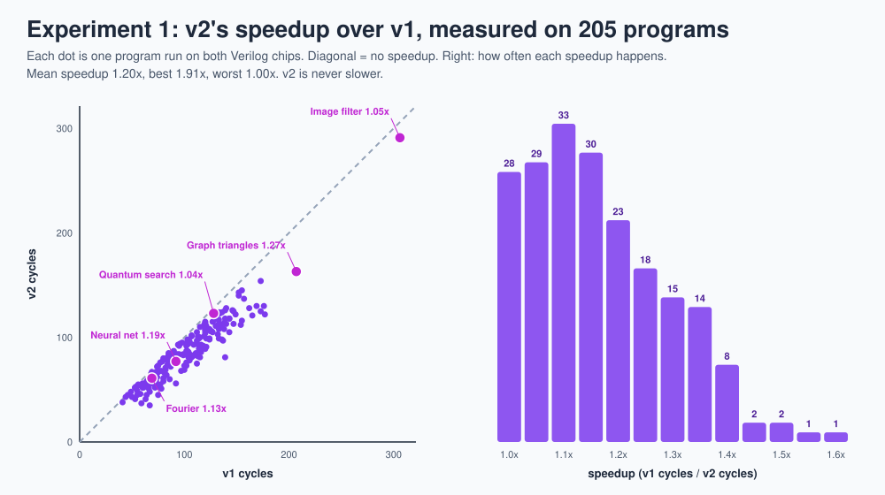
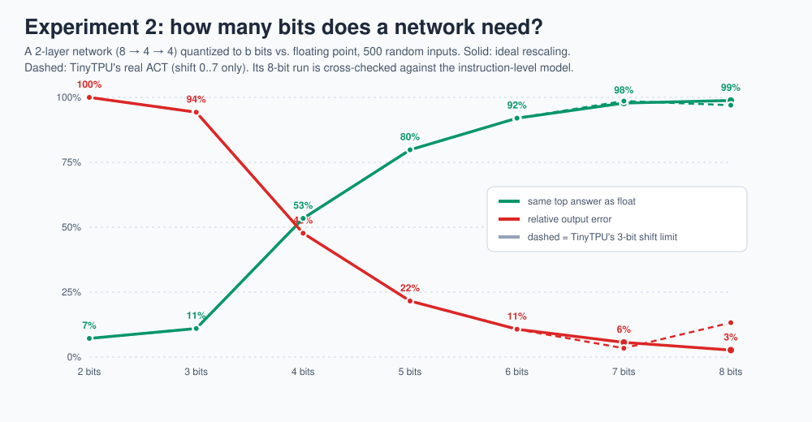
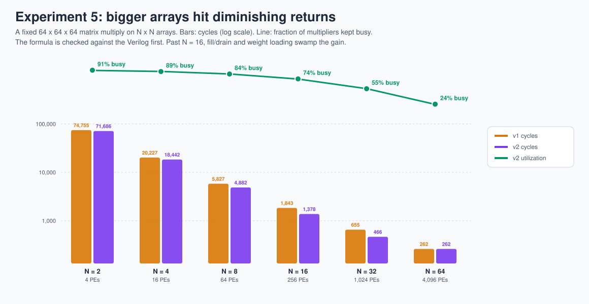

# 16 · Experiments you can run

> **In one sentence:** six reproducible experiments turn the chip into a lab bench: each one asks a question, runs the Verilog or the cycle-exact model, writes a CSV, and redraws its chart.

```bash
make experiments                         # all six, a few minutes
python3 experiments/e2_quantization.py   # or one at a time
```

Results land in [`experiments/results/`](../experiments/results/) as CSV files, and the charts below are regenerated. Every experiment states what it measured and where the numbers came from; change a parameter at the top of a script and re-run to explore.

| # | Question | Runs on | Script |
|---|---|---|---|
| 1 | How much faster is v2, program by program? | Verilog, 205 programs × 2 chips | [`e1_speedup.py`](../experiments/e1_speedup.py) |
| 2 | How many bits does a neural network need? | instruction-level model (cross-checked) | [`e2_quantization.py`](../experiments/e2_quantization.py) |
| 3 | Where does the energy go? | cycle-exact model, event counts | [`e3_energy.py`](../experiments/e3_energy.py) |
| 4 | Which PE is busy on which cycle? | cycle-exact model | [`e4_spacetime.py`](../experiments/e4_spacetime.py) |
| 5 | Does a bigger array always help? | timing model validated on the Verilog | [`e5_scaling.py`](../experiments/e5_scaling.py) |
| 6 | How much work is multiplying by zero? | instruction-level model, instrumented | [`e6_sparsity.py`](../experiments/e6_sparsity.py) |

---

## Experiment 1 · v2's speedup, measured



**Result:** v2 is **never slower**, and averages about **1.2×** over 205 programs (best 1.9×). The biggest wins come from programs with many short `MMUL`s, where v1 spends most of its time waiting for the array to drain. The image filter gains the least (1.05×) because its three long `MMUL`s already keep the array busy.

**Try:** change the fuzzer in `tools/golden_model.py` to use only long `MMUL`s (rows 64-128). Does the speedup disappear?

## Experiment 2 · How many bits?



**Result:** with good rescaling, 6 bits already pick the same answer as floating point 92 % of the time, and 8 bits 99 %. Below 4 bits the network falls apart.

**A real hardware finding:** the dashed line uses TinyTPU's actual `ACT` instruction, whose shift field is only 3 bits (shift 0-7). At 8 bits, full-range data needs a shift of 9, so TinyTPU **saturates** and its error jumps from 3 % to 13 %. This is exactly why real TPUs and int8 inference libraries rescale with a 32-bit fixed-point **multiplier** plus a shift, not a small shift alone. That fix is a good extension of [Lab 2](17-labs.md#lab-2--add-an-instruction).

## Experiment 3 · Where the energy goes


Event counts come from the cycle-exact model; prices from the 45 nm table in [lesson 5](05-dataflow-and-energy.md). These are estimates for proportions, not a power sign-off.

**Result:** with weights in on-chip SRAM, the arithmetic and on-chip memories share the energy, 2-4 pJ per multiply-accumulate. Move the weights to off-chip DRAM (as TPU v1 did) and **weight fetches dominate everything**: from 2x more energy per MAC (the image filter, which loads only 3 weight tiles for 3,072 MACs) to 12x more (the quantum search, which reloads weights between tiny batches). Programs that reload weights often (the quantum search, the graph) suffer most. That is the quantitative case for weight reuse, big batches, and TPU v2's move to High Bandwidth Memory (HBM).

## Experiment 4 · The chip in space and time


One horizontal band per application: 16 rows (one per PE) by one column per clock cycle. The diagonal staircases are the systolic wavefront, drawn from the real simulation.

**Result:** utilization ranges from 16 % (quantum search: 4-vector batches) to 63 % (image filter: 64-vector batches). The amber stripes (weight loading) and pale gaps (instruction overhead and draining) are where v2 and bigger batches claw time back.

## Experiment 5 · Bigger arrays hit diminishing returns



A fixed 64 × 64 × 64 matrix multiply on arrays from 2 × 2 to 64 × 64. The cycle formula is first **validated against the Verilog** (exact for v1, within 1 cycle for v2).

**Result:** going from N = 2 to 16 cuts the time 52x, but utilization falls from 91 % to 74 %, and at N = 64 only 24 % of the 4,096 multipliers are busy. Once the array is as big as the matrix, fill and drain (2N − 1 cycles) and weight loading (N cycles per tile) dominate. That is why TPU v1's 256 × 256 array needed batches of hundreds, and why later TPUs use several **smaller** 128 × 128 arrays per chip.

**Try:** set `M = 1024` at the top of `e5_scaling.py` (a bigger batch). Where does the curve bend now?

## Experiment 6 · How much work is multiplying by zero?


The instruction-level model is instrumented to classify every multiply-accumulate by whether its weight, its input, or both were zero.

**Result:** 22 % of the neural network's MACs had a zero operand (random small integers plus ReLU zeros), 45 % of the quantum search's (gate matrices are mostly zeros), 75 % of the image filter's, and 79 % of the graph workload's. A quarter of the image filter's MACs are pure padding: K = 9 rounded up to 12 for the 4-wide array. This waste is the opportunity sparse accelerators exploit; see [lesson 19](19-research-frontiers.md#1--sparsity-stop-multiplying-by-zero).

---

## Designing your own experiment

The helpers in [`experiments/common.py`](../experiments/common.py) give you four building blocks:

| Helper | Does |
|---|---|
| `make_case(demo, seed)` | writes the memory images for any demo, or a random program |
| `rtl_cycles(compile_rtl("v2_pipelined"))` | runs the Verilog, checks correctness, returns cycles |
| `js_trace()` | per-cycle controller state, busy PEs, and event counts |
| `write_csv(name, header, rows)` | saves results next to the others |

Ideas: measure how often v2 stalls and on which hazard; compare the energy of the two loop orders in [lesson 6](06-tiling.md); find the smallest batch where the image filter beats 50 % utilization on an 8 × 8 array.

**Next → [17 · Hands-on labs](17-labs.md)**
