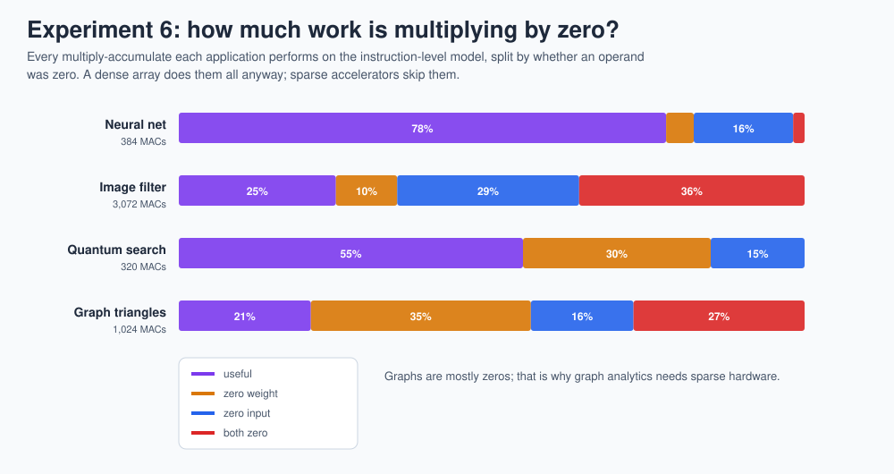

# 19 · Research frontiers: where TPU-style hardware is going

> **In one sentence:** the systolic array is settled; the open research is about everything around it: skipping zeros, using fewer bits, choosing the dataflow, feeding it from memory, compiling for it, and scaling it out.

Each section below says what the problem is, what the key papers found, and a concrete **try it here** project you can do with this repo. The papers are all in the [research library](../web/research.html) with links.

---

## 1 · Sparsity: stop multiplying by zero

**The problem.** A dense array multiplies every weight by every input. [Experiment 6](16-experiments.md#experiment-6--how-much-work-is-multiplying-by-zero) measures how much of that is wasted on TinyTPU's own applications: **22 %** of the neural network's multiply-accumulates, **75 %** of the image filter's (a quarter of it is just padding K = 9 up to 12), and **79 %** of the graph workload's have a zero operand.

**What research found.**
* *Unstructured* sparsity (any weight can be zero) saves the most work but breaks the regular dataflow; EIE (Han et al., 2016) built a dedicated engine around compressed sparse matrices.
* *Structured* sparsity keeps the hardware regular: NVIDIA's **2:4** pattern (2 zeros in every group of 4 weights) lets Tensor Cores skip half the math with a small multiplexer per lane (Mishra et al., 2021).
* TPU v4 added **SparseCores** for embedding lookups, the sparse part of recommendation models (Jouppi et al., 2023).

**Try it here.** Add a "skip" signal to `pe.v`: when `w == 0`, clock-gate the multiplier and count the skipped cycles. Then enforce 2:4 sparsity in the weight tiles of `tools/apps.py` and measure accuracy on the image filter. Does the Laplacian survive?

## 2 · Fewer bits

**The problem.** Multiplier area grows roughly with the square of the bit width ([lesson 3](03-numbers-and-quantization.md)), and memory traffic grows linearly. Every bit removed is area, energy, and bandwidth saved.

**What research found.**
* int8 inference with 32-bit accumulators is standard (Jacob et al., 2018); TinyTPU implements it.
* Training moved from FP32 to mixed precision (Micikevicius et al., 2018), then to **bfloat16** (Kalamkar et al., 2019), then to **FP8** in two flavors, E4M3 and E5M2 (Micikevicius et al., 2022).
* Research now pushes to 4-bit weights and below, usually with per-group scale factors.

**Try it here.** [Experiment 2](16-experiments.md#experiment-2--how-many-bits) found a real limitation: TinyTPU's 3-bit shift can't rescale full-range 8-bit data. Replace the shift in `activation.v` with a 16-bit fixed-point multiplier plus shift (the Jacob et al. scheme), add it to the instruction-level model first, and rerun experiment 2. The dashed line should meet the solid one.

## 3 · Choosing the dataflow

**The problem.** Weight-stationary is one choice among many. Which one wins depends on the layer shape and the memory hierarchy ([lesson 5](05-dataflow-and-energy.md)).

**What research found.** Eyeriss (Chen, Emer, Sze, 2016) introduced the taxonomy and row-stationary; MAESTRO (Kwon et al., 2019) predicts reuse and energy analytically for any dataflow; SCALE-Sim (Samajdar et al., 2018) simulates systolic arrays of any size cycle by cycle. The Sze et al. survey (2017) ties it all together.

**Try it here.** [Lab 7](17-labs.md#lab-7--output-stationary-array) builds an output-stationary array. Then extend `tools/trace_js.js`-style event counting to both designs and compare energy per MAC on the image filter, where reuse patterns differ most.

## 4 · Feeding the array: memory and interconnect

**The problem.** The roofline ([lesson 11](11-performance.md)) says a faster array is useless if memory can't keep up. TPU v1's own paper found most of its production networks were memory-bound because weights came from DDR3 at 34 GB/s.

**What research found.** TPU v2 moved to High Bandwidth Memory (HBM) and chip-to-chip links in a 2-D torus (Jouppi et al., 2020); TPU v4 wires 4,096 chips into a 3-D torus that **optical circuit switches** can reshape on demand (Jouppi et al., 2023).

**Try it here.** Give the chip model a limited weight-memory bandwidth (for example, one weight row every 4 cycles instead of every cycle) in `web/tinytpu-core.js` and in the RTL, then rerun [experiment 5](16-experiments.md#experiment-5--bigger-arrays-hit-diminishing-returns). Where does the scaling curve bend now?

## 5 · Compilers and scheduling

**The problem.** Hardware only runs as fast as the instruction stream it's given. Tiling, loop order, and instruction reordering are compiler jobs ([lesson 6](06-tiling.md)).

**What research found.** XLA compiles TensorFlow, JAX, and PyTorch for TPUs; TVM (Chen et al., 2018) automatically searches schedules for many hardware targets. "Ten Lessons From Three Generations Shaped Google's TPUv4i" (Jouppi et al., 2021) lists compiler compatibility as a first-class design constraint.

**Built for you.** [`tools/tpu_compile.py`](../tools/tpu_compile.py) and the [compiler page](../web/compile.html) already do tiling, allocation, scheduling and calibration. Its `--hoist` option moves each `ACT` after the next `LDW`, which v2 turns into real time: the 8-12-8-4 network drops from 483 to 453 cycles on the v2 Verilog (545 on v1 either way). **Try it here:** add a loop-order option (K-tile outer vs column-tile outer), or teach the scheduler to batch several column tiles' `ACT`s, and measure with `make compile-test`.

## 6 · Open-source silicon

**The problem.** Until recently, making a chip required a commercial process design kit and tools that cost more than most universities could pay.

**What changed.** The SkyWater SKY130 open process design kit (2020), Yosys synthesis, and the OpenROAD / OpenLane flow (Ajayi et al., 2019) mean a student can take Verilog all the way to a manufacturable layout. Berkeley's **Gemmini** (Genc et al., 2021) is an open systolic-array generator attached to a RISC-V system-on-chip, evaluated with real software.

**Try it here.** [Lab 6](17-labs.md#lab-6--toward-silicon) sizes a Tiny Tapeout version; the [chip X-ray](../web/xray.html) shows what the floor plan would look like. Comparing TinyTPU's PE with a Gemmini PE (same 8-bit inputs, 32-bit accumulators) is a good first research write-up.

---

## A research-project template

1. **Question:** one sentence, measurable. *"Does 2:4 weight sparsity cut TinyTPU's energy per useful MAC by more than 30 % on the image filter?"*
2. **Baseline:** the unmodified repo, with `make test` passing and the relevant experiment's CSV saved.
3. **Change:** model first (`tools/tpu_isa_sim.py`), then RTL, then the JavaScript model; add a mutant that breaks your feature.
4. **Measure:** a new `experiments/eN_*.py` script that writes a CSV and a chart.
5. **Report:** what changed, by how much, and the one thing that surprised you.

**Next → [20 · Reading the TPU v1 paper with this repo](20-reading-the-tpu-paper.md)**
