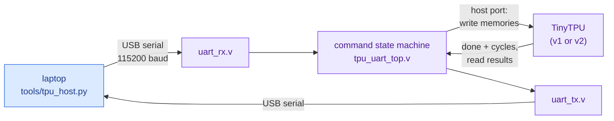

# 21 · Running TinyTPU on a real FPGA

> **In one sentence:** wrap the chip in a serial port, put it on a field-programmable gate array (FPGA) board, and drive it from your laptop with `tools/tpu_host.py`, the same programs, the same answer key, real hardware.



## What was added

| File | Role |
|---|---|
| `rtl/v1_simple/tpu_top.v`, `rtl/v2_pipelined/tpu_top.v` | a **host port** on both chips: write the instruction memory, weight memory, or Unified Buffer; read the Unified Buffer and (through a second read port) the accumulators |
| [`rtl/fpga/uart_rx.v`](../rtl/fpga/uart_rx.v), [`uart_tx.v`](../rtl/fpga/uart_tx.v) | 8N1 serial receiver and transmitter |
| [`rtl/fpga/tpu_uart_top.v`](../rtl/fpga/tpu_uart_top.v) | a one-letter command protocol around the chip |
| [`tb/tb_uart.v`](../tb/tb_uart.v) | a testbench that talks to the chip **only through the serial pins** |
| [`tools/tpu_host.py`](../tools/tpu_host.py) | the laptop side; `--fake` runs it against a virtual board |
| [`tools/fpga_report.sh`](../tools/fpga_report.sh) | FPGA resource report with Yosys |

## The protocol

| Send | Meaning | Reply |
|---|---|---|
| `P` | ping | `K` |
| `I` addr b3 b2 b1 b0 | instruction[addr] = 32-bit word, big-endian | |
| `W` addr l0 l1 l2 l3 | weight memory[addr] = four int8 lanes | |
| `U` addr l0 l1 l2 l3 | Unified Buffer[addr] = four int8 lanes | |
| `G` | reset the controller and run until `HALT` | `D` + cycle count (4 bytes) |
| `R` addr | read Unified Buffer[addr] | 4 bytes, lane 0 first |
| `A` addr | read accumulators[addr] | 16 bytes: 4 lanes, each big-endian |

The chip is held in reset except during `G`, so writes can never collide with a running program.

## Step 1 · Simulate it (no hardware needed)

```bash
make uart
```

The testbench loads a program byte by byte over the serial line, runs it, reads all 256 Unified Buffer rows and all 256 accumulator rows back over the serial line, and compares them with the answer key. It must report the same cycle counts as the direct simulation: 92 / 77 for the neural network, 306 / 291 for the image filter.

Try the laptop side without a board, too:

```bash
python3 tools/tpu_host.py --fake --demo conv
```

## Step 2 · How big is it?

```bash
make fpga-synth          # writes data/fpga.csv
```

Yosys synthesis for a Lattice ECP5:

| Chip inside | LUT4 | distributed RAM (DPR16X4) | block RAM (DP16KD) | 18 × 18 multipliers | flip-flops |
|---|---|---|---|---|---|
| v1_simple | 9,394 | 1,792 | 2 | 16 | 1,159 |
| v2_pipelined | 9,550 | 1,792 | 2 | 16 | 1,520 |

Things to notice:

* **Each processing element's 8 × 8 multiplier became one hard DSP multiplier** (16 of the 28 on an LFE5U-25F). The FPGA has real multipliers built in, so the array is cheap.
* **The memories dominate.** 256-entry memories read *combinationally* (in the same cycle) can't use block RAM, so they become distributed RAM built from look-up tables. Changing them to synchronous reads would move them into block RAM but add a cycle of latency: a good redesign exercise.
* v2 costs about 360 more flip-flops (shadow weights, swap flags, metadata pipeline), matching the sky130 story in [lesson 12](12-rtl-to-silicon.md).

An LFE5U-25F has 24,288 LUTs, so the design should fit with room to spare; place-and-route (next step) gives the exact number and the maximum clock speed.

## Step 3 · Build a bitstream

Using the open-source ECP5 flow (Yosys, nextpnr-ecp5, Project Trellis, openFPGALoader). On a 25 MHz board the bit time is 25,000,000 ÷ 115,200 ≈ 217 clocks:

```bash
sudo apt install -y nextpnr-ecp5 fpga-trellis openfpgaloader     # or the OSS CAD Suite
yosys -p "read_verilog rtl/fpga/*.v rtl/common/*.v rtl/v2_pipelined/*.v; \
          chparam -set CLKS_PER_BIT 217 tpu_uart_top; synth_ecp5 -top tpu_uart_top -json build/fpga/tpu.json"
nextpnr-ecp5 --25k --package CABGA381 --lpf rtl/fpga/boards/ulx3s.lpf \
             --json build/fpga/tpu.json --textcfg build/fpga/tpu.config
ecppack build/fpga/tpu.config build/fpga/tpu.bit
openFPGALoader -b ulx3s build/fpga/tpu.bit
```

[`rtl/fpga/boards/ulx3s.lpf`](../rtl/fpga/boards/ulx3s.lpf) is a **template** for the ULX3S board: check every pin against the board's official constraint file before programming. For another board, change `--25k`, `--package`, the constraint file, and `CLKS_PER_BIT` to match its clock.

## Step 4 · Run it

```bash
pip install pyserial
python3 tools/tpu_host.py --port /dev/ttyUSB0 --demo mlp
```

On Windows Subsystem for Linux (WSL), a USB serial port has to be attached to Linux first (for example with `usbipd`), or run the script from Windows with `--port COM5`. Expected output: the same cycle count as simulation, and `PASS - all 512 memory words match the answer key`.

**Nothing in steps 3 and 4 has been run on physical hardware yet.** The protocol and the host script are tested against the simulated serial pins (`make uart`) and the virtual board (`--fake`); a real board is the next milestone. If it doesn't answer the ping, check the baud rate (`CLKS_PER_BIT`), the RX/TX pin swap, and that the port is the FPGA's.

## Where this leads

* **Lab:** move the memories to synchronous block RAM, re-time the controller by one cycle, and compare resources and maximum clock.
* **Tiny Tapeout:** the same host-port idea works with a Serial Peripheral Interface (SPI) front end and much smaller memories ([Lab 6](17-labs.md#lab-6--toward-silicon)).

**Next → [Glossary](glossary.md)**
