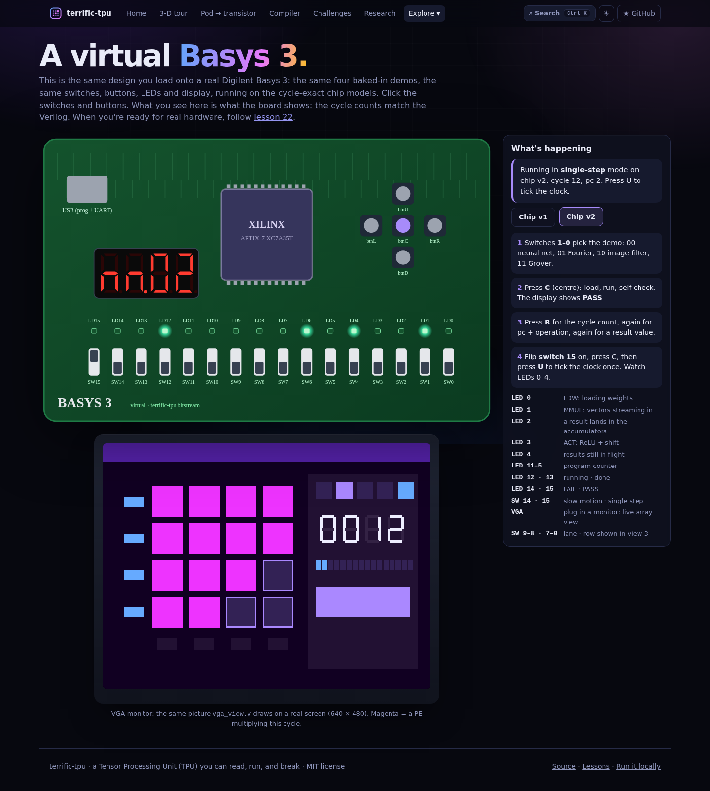
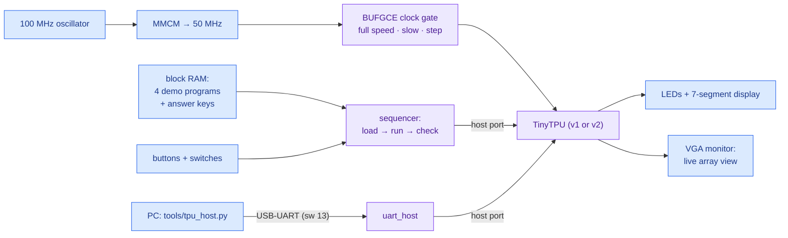

# 22 · TinyTPU on a Digilent Basys 3

> **In one sentence:** load one bitstream onto a [Digilent Basys 3](https://www.amazon.com/dp/B00NUE1WOG) and the board runs four TinyTPU programs on its own, checks its own answers, and lets you single-step the chip one clock edge at a time while the LEDs show what every part is doing.



**Try it before you buy:** the [virtual Basys 3](../web/basys3.html) runs the same design (same demos, switches, buttons, LEDs, display) on the cycle-exact chip models.

---

## What you need

| Item | Notes |
|---|---|
| Digilent Basys 3 | Artix-7 XC7A35T-1CPG236C FPGA, 16 switches, 16 LEDs, 5 buttons, 4-digit 7-segment display, USB programming + USB-UART on one micro-USB port |
| Micro-USB cable | a **data** cable, not charge-only |
| VGA monitor + cable (optional) | any monitor with a VGA input, or an HDMI monitor through a VGA-to-HDMI adapter that has its own power |
| AMD Vivado ML Standard Edition | free; supports the XC7A35T. Install on **Windows** (or native Linux): USB access from Windows Subsystem for Linux (WSL) is awkward for programming |
| This repo | clone it on the machine that runs Vivado, or reach your WSL copy from Windows at `\\wsl$\Ubuntu\home\<you>\terrific-tpu` |

## Datasheets and manuals

| Document | What it's for |
|---|---|
| [Basys 3 Reference Manual](https://digilent.com/reference/programmable-logic/basys-3/reference-manual) (Digilent) | the board: power, jumpers, every switch, LED, button and connector, the USB-UART, the flash |
| [Basys 3 master constraints file](https://github.com/Digilent/digilent-xdc) (`Basys-3-Master.xdc`) | official pin assignments; [`rtl/fpga/basys3/basys3.xdc`](../rtl/fpga/basys3/basys3.xdc) follows it |
| AMD DS180, *7 Series FPGAs Data Sheet: Overview* | how many lookup tables (LUTs), flip-flops, block RAMs, and DSP slices the XC7A35T has |
| AMD DS181, *Artix-7 FPGAs Data Sheet: DC and AC Switching Characteristics* | electrical limits and speeds |
| AMD UG472, *7 Series FPGAs Clocking Resources* | the MMCM (makes the 50 MHz clock) and BUFGCE (gates the TPU clock) used here |
| AMD UG479, *7 Series DSP48E1 Slice* | the hard multipliers the PEs map onto |
| AMD UG473, *7 Series FPGAs Memory Resources* | block RAM, where the demo programs live |
| AMD UG908, *Vivado: Programming and Debugging* | Hardware Manager, programming the flash |

AMD's documents are at [docs.amd.com](https://docs.amd.com/) (search for the document number).

## What the design does

[`rtl/fpga/basys3/basys3_top.v`](../rtl/fpga/basys3/basys3_top.v) wraps the chip (v2 by default) with:



| Control | Does |
|---|---|
| **SW 1–0** | demo: `00` neural net · `01` Fourier transform · `10` image filter · `11` Grover's search |
| **btnC** (centre) | load the demo from block RAM, run it, check all 256 Unified Buffer rows against the answer key |
| **btnR / btnL** | next / previous display view (the lit decimal point shows which) |
| **btnD** | back to idle |
| **SW 15** + **btnU** | single step: the TPU clock ticks once per press |
| **SW 14** | slow motion: 4 TPU clock ticks per second |
| **SW 7–0, 9–8** | which Unified Buffer row and lane view 3 shows |
| **SW 13** | UART mode: the PC drives the chip with `tools/tpu_host.py` |

| Display view | Shows |
|---|---|
| 0 | `IdLE`, `LOAd`, `run`, then **`PASS`** or `FAIL` (`UAr` in UART mode) |
| 1 | clock cycles the program took (decimal) |
| 2 | current operation and program counter: `Ld 03`, `nn 02` (MMUL streaming), `AC 05` |
| 3 | the selected result, signed decimal |

| LED | Meaning |
|---|---|
| 0 | `LDW`: weights shifting in |
| 1 | `MMUL`: vectors streaming into the array |
| 2 | a result landing in the accumulators |
| 3 | `ACT`: ReLU + shift writing back |
| 4 | results still in flight |
| 11–5 | program counter |
| 12 · 13 | running · done |
| 14 · 15 | **FAIL** · **PASS** |

## The VGA monitor view

Plug a monitor into the board's VGA port and [`vga_view.v`](../rtl/fpga/basys3/vga_view.v) draws the chip live at 640 × 480: the 4 × 4 array with each processing element (PE) lit **magenta on the cycles it multiplies**, the four input lanes (blue) and result lanes (green), five operation lamps, the cycle counter, a program-counter bar, and a status banner.

| Single-stepped to cycle 12 of the neural net | After the run |
|---|---|
|  |  |

These two pictures were not drawn by hand. `make basys3-vga` simulates the board's VGA pins frame by frame, checks the timing (525 lines of 800 pixels, the standard 640 × 480 format), and saves exactly what a monitor would show. The [virtual board](../web/basys3.html) draws the same picture next to its switches.

Single-step with SW 15 and btnU while watching the monitor: the magenta diagonal moves one PE per press. That is the systolic wavefront, on real hardware.

## Step 1 · Simulate the board (any machine)

```bash
make basys3
make basys3-vga        # also save the VGA frames as PNG images (needs Pillow: pip install pillow)
```

The testbench presses the buttons and flips the switches like you would: every demo passes its self-check, 10 presses of btnU give exactly 10 clock cycles, slow motion finishes on its own, view 3 shows the right number, and when the answer key is deliberately corrupted the board shows FAIL. Expected cycle counts:

| Demo | v1_simple | v2_pipelined (default) |
|---|---|---|
| 00 neural net | 92 | 77 |
| 01 Fourier | 69 | 61 |
| 10 image filter | 306 | 291 |
| 11 Grover | 128 | 123 |

## Step 2 · Will it fit?

```bash
make basys3-synth        # Yosys estimate → data/basys3.csv
```

| Resource | Used | XC7A35T has |
|---|---|---|
| Lookup tables (logic) | ≈ 9,400 | 20,800 |
| Lookup tables used as memory | ≈ 2,750 | (part of the 20,800) |
| Flip-flops | ≈ 1,400 | 41,600 |
| DSP48E1 multipliers | 16 (one per PE) | 90 |
| Block RAM (36 Kb) | 4 (the demo ROMs) | 50 |

Plenty of room. Vivado's own `build/utilization.rpt` is the final word.

## Step 3 · Build the bitstream (Vivado)

Open the **Vivado Tcl Shell** (Windows Start menu) or a Linux terminal with Vivado's `settings64.sh` sourced:

```bash
cd terrific-tpu/rtl/fpga/basys3
python3 ../../../tools/make_board_mem.py          # only if you changed the demos
vivado -mode batch -source build.tcl              # chip v2 (default), 5–15 minutes
vivado -mode batch -source build.tcl -tclargs v1_simple   # or chip v1
```

Then open `build/timing.rpt` and find **WNS** (worst negative slack). Positive means the design meets 50 MHz. If it's comfortably positive, you can try `CLK_MHZ = 100` in `basys3_top.v` and rebuild.

## Step 4 · Program the board

1. Set the **JP1** mode jumper to **JTAG** (see the reference manual), plug in USB, switch **power on**.
2. Program it:
   ```bash
   vivado -mode batch -source program.tcl
   ```
   or in the Vivado GUI: *Open Hardware Manager → Open Target → Auto Connect → Program Device* and pick `build/tinytpu_basys3.bit`.
3. The display shows `IdLE`. You're ready.

Programming over JTAG is lost at power-off. To keep it, write it to the board's SPI flash: in Hardware Manager, *Add Configuration Memory Device*, choose the flash part the reference manual lists for your board revision, generate a `.mcs` with `write_cfgmem`, program it, then set JP1 to **QSPI**.

## Step 5 · Try it

1. **All demos pass.** Set SW 1–0 to each value, press C. The display should read `PASS` and LED 15 should light. Press R: the cycle count should match the table above.
2. **Watch the chip think.** Flip SW 15 on, press C, then press U slowly. On chip v2 the neural network starts like this (LED 4 3 2 1 0, 1 = lit):

   | Cycle | LEDs 4–0 | What's happening |
   |---|---|---|
   | 2–5 | `00001` | `LDW`: four weight rows shift in |
   | 8 | `00010` | `MMUL`: the first vector enters |
   | 9–14 | `10010` | more vectors stream in; results are in flight |
   | 15 | `10110` | the first result lands while the last vector enters |
   | 18–21 | `10101` | the **next `LDW` runs while results are still landing**: v2's overlap, visible on the LEDs |

3. **Slow motion.** Flip SW 15 off and SW 14 on, press C, and watch the program counter (LEDs 11–5) count through the program.
4. **Read a result.** After `PASS`, press R three times (view 3) and set SW 7–0 to a row, e.g. 24 for the first output row of the neural net.
5. **From your PC.** Flip SW 13 on (the display shows `UAr`), find the board's COM port in Device Manager, and run:
   ```bash
   pip install pyserial
   python tools/tpu_host.py --port COM5 --demo conv      # any demo, or --demo fuzz
   ```

## Troubleshooting

| Symptom | Check |
|---|---|
| Vivado can't see the board | data cable; power switch on; Digilent/FTDI cable drivers installed with Vivado |
| Display stays dark | bitstream programmed? JP1 on JTAG? |
| `FAIL` | rebuild with `make_board_mem.py` run from this repo version; run `make basys3` to confirm the design itself passes |
| `tpu_host.py` gets no answer | SW 13 on; right COM port; nothing else (a serial monitor) holding the port |
| Timing fails (negative WNS) | stay at `CLK_MHZ = 50`; note the failing path in `timing.rpt` |

## What has and hasn't been tested

| Tested | How |
|---|---|
| ✅ the board logic, on both chips | `make basys3`: demos, self-check, sabotage, step, slow, display |
| ✅ VGA timing and picture | `make basys3-vga`: 525 lines × 800 pixels, frames saved as images |
| ✅ the serial protocol | `make uart` and `tpu_host.py --fake` |
| ✅ it fits the XC7A35T | Yosys `synth_xilinx` estimate |
| ⬜ Vivado build, timing, real board | not yet run; please report the WNS and whether you see `PASS` |

The pin assignments follow Digilent's master constraints file; if anything doesn't respond, compare `basys3.xdc` against it first.

**Next → [Glossary](glossary.md)**
